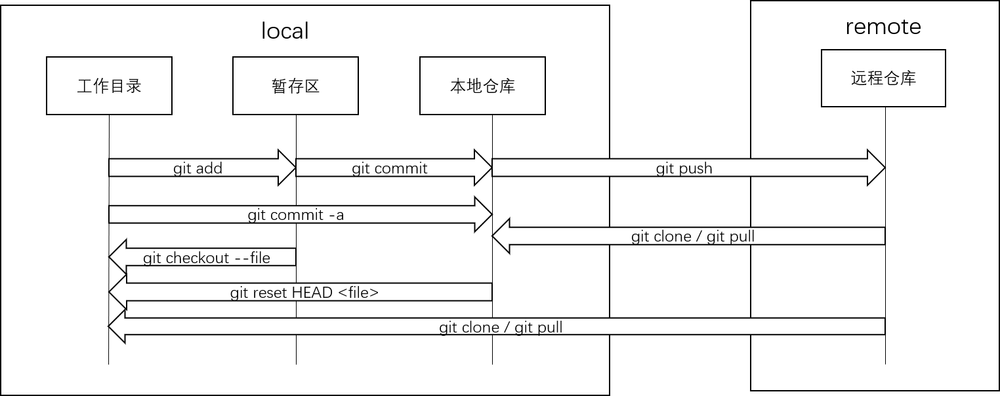
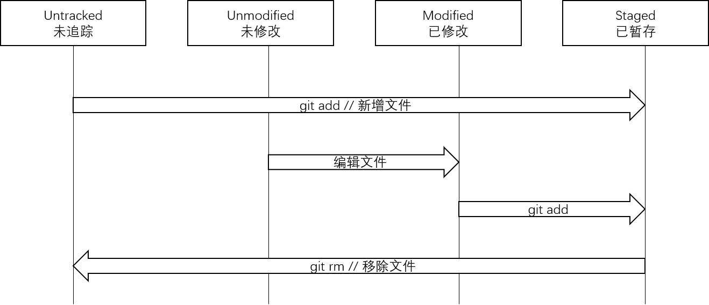
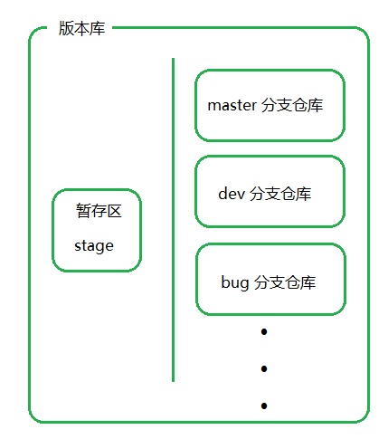
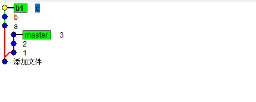
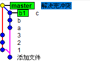
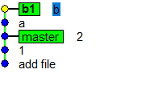

## 创建版本库
### 创建git仓库
```
$ mkdir learngit
$ cd learngit
$ pwd
/Users/michael/learngit
$ git init
Initialized empty Git repository in /Users/michael/learngit/.git/
```

### 把一个文件放到Git仓库
```
git add readme.txt  
git commit -m "wrote a readme file"  # 提交说明

# commit一次可以提交多个文件
git add file1.txt
git add file2.txt file3.txt
git commit -m "add 3 files."
```
## git基本操作
### 版本回退
版本控制系统肯定有某个命令可以告诉我们历史记录，在Git中，我们用git log命令查看
```
git log  # 命令显示从最近到最远的提交日志, 如果嫌输出信息太多，看得眼花缭乱的，可以试试加上
git log --oneline
```
首先，Git必须知道当前版本是哪个版本，在Git中，用HEAD表示当前版本，也就是最新的提交1094adb...（注意我的提交ID和你的肯定不一样），上一个版本就是HEAD^，上上一个版本就是HEAD^^，当然往上100个版本写100个^比较容易数不过来，所以写成HEAD~100。
```
$ git reset --hard HEAD^  # hard暂时不用管
```
最新的那个版本append GPL已经看不到了！好比你从21世纪坐时光穿梭机来到了19世纪，想再回去已经回不去了，肿么办？

办法其实还是有的，只要上面的命令行窗口还没有被关掉，你就可以顺着往上找啊找啊，找到那个append GPL的commit id是1094adb...，于是就可以指定回到未来的某个版本：
```
$ git reset --hard 1094a
```
版本号没必要写全，前几位就可以了，Git会自动去找。当然也不能只写前一两位，因为Git可能会找到多个版本号，就无法确定是哪一个了。此外Git提供了一个命令git reflog用来记录你的每一次命令

### 工作区和暂存区


工作区有一个隐藏目录.git，这个不算工作区，而是Git的版本库。Git的版本库里存了很多东西，其中最重要的就是称为stage（或者叫index）的暂存区，还有Git为我们自动创建的第一个分支master，以及指向master的一个指针叫HEAD。  
第一步是用git add把文件添加进去，实际上就是把文件修改添加到暂存区；第二步是用git commit提交更改，实际上就是把暂存区的所有内容提交到当前分支。  
因为我们创建Git版本库时，Git自动为我们创建了唯一一个master分支，所以，现在，git commit就是往master分支上提交更改。
#### 查看当前状态
```
$ git status
```

### 管理修改
只要进行add操作的内容能被commit上去。用git diff HEAD -- readme.txt命令可以查看工作区和版本库里面最新版本的区别：
```
$ git diff HEAD -- readme.txt
```
### 撤销修改
当你改乱了工作区某个文件的内容，想直接丢弃工作区的修改时，用命令git checkout -- file。
```
$ git checkout -- file
```
当你不但改乱了工作区某个文件的内容，还添加到了暂存区时，想丢弃修改，分两步，第一步用命令git reset HEAD <file>，就回到了场景1，第二步按场景1操作
```
$ git reset HEAD readme.txt
```
### 删除文件
一般情况下，你通常直接在文件管理器中把没用的文件删了，或者用rm命令删了：
```
$ rm test.txt
```
* 现在你有两个选择，一是确实要从版本库中删除该文件，那就用命令git rm删掉，并且git commit：
```
$ git rm test.txt
$ git commit -m "remove test.txt"
```
* 另一种情况是删错了，因为版本库里还有呢，所以可以很轻松地把误删的文件恢复到最新版本：
```
$ git checkout -- test.txt
```
git checkout其实是用版本库里的版本替换工作区的版本，无论工作区是修改还是删除，都可以“一键还原”。
## 远程仓库
```
ssh-keygen -t rsa -C "youremail@example.com"
```
生成秘钥和github绑定
### 添加远程仓库
在github界面创建一个远程库
### 从远程仓库clone
1. 从远程拉一个文件夹到本地
```
git clone https://github.com/shankace/learning-files.git
```
会在当前目录创建learning-files文件夹。  
2. 提交文件
* 提交所有文件
```
git add .
```
* 提交单个文件
```
git add <filename>
git commit -m "message"
git push origin master
```

## git文件存储和状态转换



------



## git 分支

### 分支的概念

我们习惯于将分支仓库的概念等同于版本库，其实二者完全不同的两种概念。当一个版本库被创建成功时，它会默认的为我们创建一个 master 分支仓库。实际上，一个版本库中会有很多个分支仓库。



### 分支操作

```
git branch test  // 创建test分支
git branch -d test  // 删除分支
git checkout master  // 切换分支
git checkout -b  //创建并进入分支
gitk --all  // 查看分支状态
git log --oneline  // 查看提交日志
```

### 分支合并

合并分支有两种方法，merge和rebase方法。

init一个新的仓库，commit一个README.md文件。创建一个分支b1。在master分支中分三次commit 1 2 3得到README.md文件：

```
1
2
3
```

在b1分支的README.md文件中分三次commit a b c得到README.md文件：

```
a
b
c
```

这里两个分支进行commit是没有冲突的，因为commit到两个分支各自的仓库中。此时分支的状态：



1）git merge方法

```
git merge b1 // 在master分支合并b1
```

出现冲突：

```
<<<<<<< HEAD
1
2
3
=======
a
b
c
>>>>>>> b1
```

- <<<< << HEAD到 ===== 是master中存在，b1中不存在的部分
- ===== 到>>>>> b1 是b1中存在，master中不存在的部分

解决冲突的方法，两个都留或者留一个都可以。都保留的情况：

```
1
2
3
a
b
c
```

```
git add README.md
git commit -m "解决冲突"
```



此时master仓库已经将b1中的内容merge，但是b1仓库并没有merge master仓库中的内容。

2）rebase

merge是一次解决所有冲突，rebase是分多次解决冲突。

```
git rebase master  // 将master合并到b1
vim README.md  // 解决冲突
git add README.md  // 提交到stage
git rebase --continue  // 反复执行2-4行命令直到rebase成功，不需要commit
```



结果是将master分支rebase到了b1的线上。b1合并了master的内容，但是master没有合并b1的内容，此时切换到master中执行git rebase b1不需要再解决冲突就能合并成功，master就会和b1在同一个节点上。

### 暂存

 git 切换分支时会把未add或未commit的内容带过去,因为未add的内容不属于任何一个分支， 未commit的内容也不属于任何一个分支。 也就是说，对于所有分支而言， 工作区和暂存区是公共的。

暂存

```
git stash save "save message"

git stash list  //查看stash了哪些存储

git stash show //显示做了哪些改动，默认show第一个存储,如果要显示其他存贮，后面加stash@{$num}，比如第二个 git stash show stash@{1}

git stash show -p  //显示第一个存储的改动，如果想显示其他存存储，命令：git stash show  stash@{$num}  -p ，比如第二个：git stash show  stash@{1}  -p

git stash apply //应用某个存储,但不会把存储从存储列表中删除，默认使用第一个存储,即stash@{0}，如果要使用其他个，git stash apply stash@{$num} ， 比如第二个：git stash apply stash@{1} 

git stash pop  //命令恢复之前缓存的工作目录，将缓存堆栈中的对应stash删除，并将对应修改应用到当前的工作目录下,默认为第一个stash,即stash@{0}，如果要应用并删除其他stash，命令：git stash pop stash@{$num} ，比如应用并删除第二个：git stash pop stash@{1}

git stash drop stash@{$num} //丢弃stash@{$num}存储，从列表中删除这个存储

git stash clear //删除所有缓存的stash
```


## fetch和pull

1）fetch需要手动合并

```
git fetch 
git rebase RETCH_HEAD
```

2）pull自动强制合并