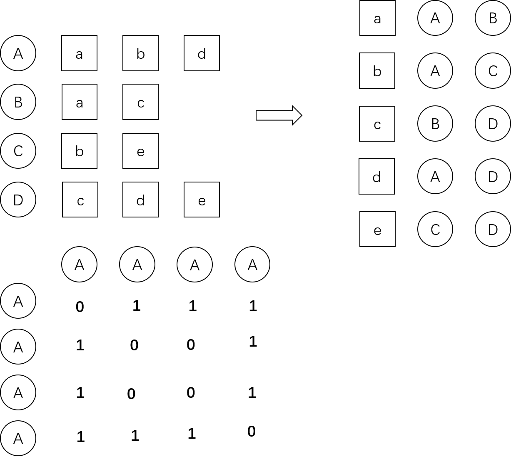
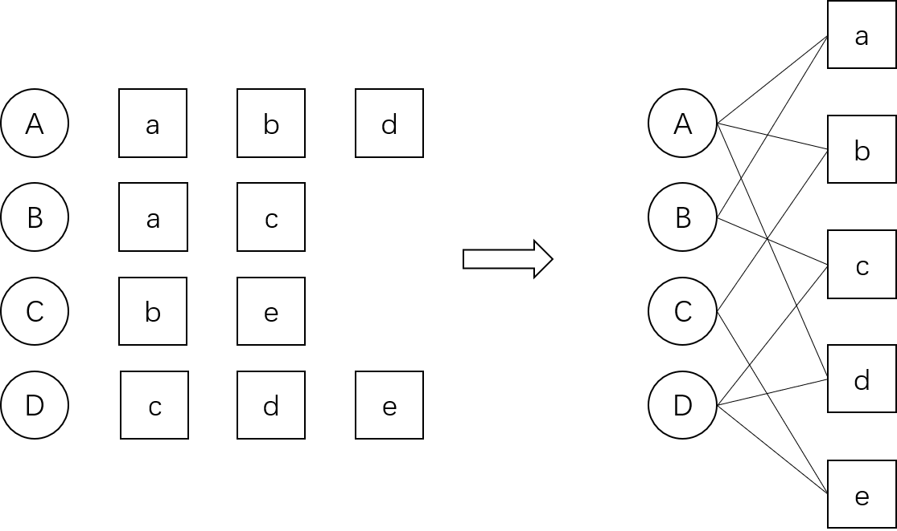
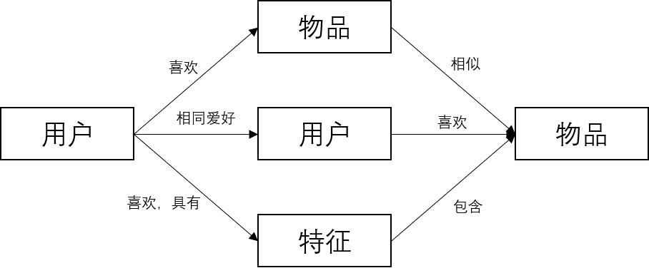
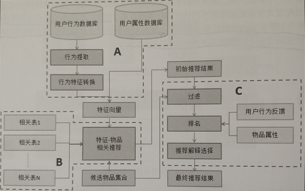

# 推荐系统
推荐系统是自动联系用户和物品的一种工具，它能够在信息过载的环境中帮助用户发现他们感兴趣的信心，也能将信息推送给它们感兴趣的用户。
## 推荐系统应用
* 电子商务
* 电影和视频网站推荐
* 个性化音乐台
* 社交网络
* 个性化阅读
* 基于位置的服务
* 个性化邮件
* 个性化广告

## 推荐系统评测
好的推荐系统不仅仅能够准确预测用户的行为，而且能够扩展用户的事业，帮助用户发现那些他们可能会感兴趣，但却不那么容易发现的东西。
### 实验方法
1. 离线实验
1.1 获取用户历史行为
1.2 通过历史行为建模
1.3 对模型进行评测
2. 用户调查

* 优点：可以获取一些离线实验无法得到的评测信息，如用户的惊喜度。
* 缺点：用户调查成本高，用户需要花大量时间完成一个任务，并且用户调查样本少时不能保证结果的统计意义。
3. 在线实验

ABTest的方式对比不同的推荐算法。
### 评测指标
1. 用户满意度

* 通过购买率度量用户的满意度
* 通过满意和不满意的反馈按钮
* 更一般情况，用点击率、用户停留时间和转化率等指标度量用户的满意度
2. 预测准确度

评分预测：  
一般通过均方根误差(RMSE)和平均绝对误差(MAE)计算。
$$
RMSE=\sqrt{\frac{\sum_{u,i\in{T}}(r_{ui}-\hat{r}_{ui})^2}{\left|T\right|}}
$$
MAE采用绝对值计算预测误差：
$$
MAE = \frac{\sum_{u,i\in{T}}(r_{ui}-\hat{r}_{ui})^2}{\left|T\right|}
$$
其中$r_{ui}$是用户u对物品i的实际评分，而$\hat{r}_{ui}$是推荐算法给出的预测评分。
TopN推荐：  
TopN推荐的预测一般通过准确率(precision)/召回率(recall)度量。R(u)是根据用户在训练集上的行为给用户作出的推荐按列表，而T(u)是用户在测试集上的行为列表。
$$
Recall=\frac{\sum_{u\in{U}}\left|R(u)\bigcap{T(u)}\right|}{\sum_{u\in{U}}\left|R(u)\right|}
$$
$$
Precision=\frac{\sum_{u\in{U}}\left|R(u)\bigcap{T(u)}\right|}{\sum_{u\in{U}}\left|R(u)\right|}
$$
有时候为了全面评测TopN推荐的准确率和召回率，一般会选取不同的推荐列表长度N，计算一组准确率和召回率，然后画出准确率和召回率的曲线。
3. 覆盖率

覆盖率描述一个推荐系统对物品长尾的发掘能力。最简单的定义为推荐系统能够推荐出额物品占总物品集合的比例。假设用户集合为U，推荐系统给每个用户推荐一个长度为N的物品列表R(u)。
$$
Coverage=\frac{\left|\bigcup_{u\in{U}}R(u)\right|}{\left|I\right|}
$$
为了更细致的描述推荐系统发掘长尾的能力，需要统计推荐列表中不同物品出现次数的分布，如果所有物品都出现在推荐系统中，并且出现的次数差不多，那么推荐系统发现长尾的能力就越好。  
另外两种定义覆盖率的方法：  

* 信息熵
$$
H = -\sum_{i=1}^{n}p(i)\log{p(i)}
$$
* Gini系数
$$
G = \frac{1}{n-1}\sum_{j=1}^{n}(2j-n-1)p(i_{j})
$$
4. 多样性

多样性描述了推荐列表中物品两两之间的不相似性。因此，多样性和相似性是对应的。$s(i, j)\in{[0, 1]}$定义了物品i和j之间的相似度，那么用户u的推荐列表R(u)的多样性定义为:
$$
Diversity(R(u)) = 1 - \frac{\sum_{i, j\in{R(u)},i\ne j}s(i, j)}{\frac{1}{2}\left|R(u)\right|(\left|R(u)\right|-1)}
$$
所有用户推荐列表的平均值：
$$
Diversity=\frac{1}{\left|U\right|}\sum_{u\in U}Diversity(R(u))
$$
关于推荐系统多样性最好达到什么程度，举例说明。假设用户80%的时间看动作片，20%的时间看动画片。4种不同的推荐列表：A列表中有10部动作片，没有动画片；B列表中10动画，0动作；C列表8动作，2动画；D列表5动画，5动作。这个例子中，一般认为C列表是最好的，具有一定的多样性，又考虑到了用户的主要兴趣。
5. 新颖性

评测新颖度的最简单的方法是利用推荐结果的平均流行度，因为越不热门的物品越有可能让用户觉得新颖。
6. 总结

在给定覆盖率、多样性、新颖性等限制条件下，尽可能优化预测准确度。  

max 预测准确度

覆盖率>A

多样性>B

新颖性>C

###  评测维度

* 用户维度：主要包括用户的人口统计学信息、活跃度以及是不是新用户等
* 物品维度：物品的属性、流行度平均分以及是不是新加入的物品等
* 时间维度：包括季节，是否为工作日，白天还是晚上等。
如果能够在推荐系统的评测报告中包含不同维度下的系统评测指标，能帮我们找到一个看上去比较弱的算法的优势，发现一个看上去比较强的算法的缺点。
# 推荐系统四种基本算法
## 基于用户的协同过滤算法(collaborative filtering)
1. 找到和目标用户兴趣相似的用户集合。
2. 找到这个集合中用户喜欢的，且目标用户没有听说过的物品推荐给目标用户。  
给定用户u和用户v，令N(u)表示用户u曾经有过正反馈的物品集合，令N(v)为用户v曾经有过正反馈的物品集合。通过余弦相似度计算用户之间的相似性：
$$
w_{uv} = \frac{\left|N(u)\bigcap N(v)\right|}{\sqrt{\left|N(u)\right|\left|N(v)\right|}}
$$
事实上，很多用户之间没有对同样的物品产生过行为，很多时候$\left|N(u)\bigcap N(v)\right|=0$。算法会将很多时间浪费在计算这种用户之间的相似度上。为此，可以首先建立物品到用户的倒排表，对于每个物品都保存对该物品产生过行为的用户列表。扫描倒排表中每个物品对应的用户列表，将用户列表中的每两个用户组合都算作一分，加到用户跟用户的相似矩阵中(初始值为0)，最终得到的用户跟用户的相似矩阵W为余弦相似度的分子部分，将W除以分母可以得到最终的用户兴趣相似度。

得到用户之间的兴趣相似度后，可以计算被推荐用户对每个物品感兴趣的程度：
$$
p(u, i) = \sum_{v\in S(u, K)\bigcap N(i)}w_{uv}r_{vi}
$$
其中，$S(u, K)$包含和用户u兴趣最接近的K个用户，$N(i)$是对物品i有过行为的用户集合，$w_{uv}$是用户$u$和用户$v$的兴趣相似度，$r_{vi}$代表用户$v$对物品$i$的兴趣，如果是隐反馈数据，这个$r_{vi}=1$。计算出用户对物品的兴趣程度之后，选出该用户未购买过的TopN物品即可。
## 基于物品的协同过滤算法
1. 计算物品之间的相似度。
2. 根据物品的相似度和用户的历史行为给用户生成推荐列表。  
$$
w_{ij} = \frac{\left|N(i)\bigcap N(j)\right|}{\sqrt{\left|N(i)\right|\left|N(j)\right|}}
$$
这里$\left|N(i)\right|$变成了喜欢物品i的用户数。$w_{ij}$计算的方式也是先建立用户到物品的倒排表，再根据倒排表进行计算。  
得到$w_{ij}$之后，可以计算用户u对一个物品j的感兴趣程度：
$$
p_{uj} = \sum_{i\in N(u)\bigcap S(j,K)}w_{ji}r_{ui}
$$
$N(u)$是用户喜欢物品的集合，$S(j,K)$是和物品j最相似的K的物品的集合。这里跟UserCF有所不同。最终推荐的时候，对于用户历史上感兴趣的每一个物品，取出它们相似度最高的前K个物品，共得到$N(u)*K$个物品，排序后取去除用户产生行为后的TopN的物品作为推荐结果。
## 优化方法
1. UserCF算法中，用户u和v的公共物品，本来每次得分都为1，每多一个就多加一分，现在对每个物品的这1分进行惩罚，该物品购买的人越多，惩罚的力度越大。
$$
w_{uv} = \frac{\sum_{i\in N(u)\bigcap N(v)}\frac{1}{\log{(1+\left|N(i)\right|)}}}{\sqrt{\left|N(u)\right|\left|N(v)\right|}}
$$
ItemCF算法中，是对物品i和j的公共用户，没多一个多加一分，对这个1分进行惩罚，除上该公共用户购买物品的总数N(u)，购买的物品越多，惩罚力度越大。
2. 对相似度进行归一化
$$
\widehat{w}_{ij} = \frac{w_{ij}}{\max_{j}w_{ij}}
$$
对于相似矩阵$w_{ij}$，有A、B和C三种物品，可能A是热门产品，A对应的行向量的值都会偏大，通过除以每一行的最大值进行归一化，可以一定程度的消除这种热门和冷门之间的差异，提升推荐系统的多样性和覆盖率。
## 隐语义模型(LFM - latent factor model)
LFM核心思想是通过隐含特征联系用户兴趣和物品。对用户对于物品兴趣进行分类，然后从分类中挑选他可能喜欢的物品。LFM中这个分类不是人工定义的，是通过监督学习计算得来的。
$$
Preference(u,i)=r_{ui}=p^T_u q_i=\sum_{k=1}^{K}p_{u,k}q_{i,k}
$$
公式中的$p_{u,k}$和$q_{i,k}$是模型的参数，其中$p_{u,k}$度量了用户u的兴趣和地k个隐类的关系，而$q_{i,k}$度量了第k个隐类和物品i之间的关系。

### 显性反馈和隐性反馈在LFM建模方式
LFM在显示反馈数据(评分或者喜爱程度分类)上解决评分或者分类预测有着较好的精度，可以直接进行建模。但是在隐性反馈数据集中，只有正样本(用户喜欢什么物品)，没有负样本(用户对什么不感兴趣)，因此需要进行负采样。
#### 负采样
1. 对于每个用户，都要保证正负样本的平衡(数目类似)。
2. 对于每个用户采样负样本时，要选取那些很热门，而用户却没有行为的物品。  
直接对训练集进行简单随机采样即可，某一物品出现的次数越多，说明它的热门程度越高，被抽中的概率也会变高。
#### 模型的损失函数
$$
C=\sum_{(u,i)\in K}(r_{ui}-\widehat{r}_{ui})^2=\sum_{(u,i)\in K}(r_{ui}-\sum_{k=1}^{K}p_{u,k}q_{i,k})^2+\lambda \left\|p_{u}\right\|^2+\lambda \left\|q_i\right\|^2
$$

对于隐性反馈数据，经过负采样之后，可以得到一个用户--物品集K={(u,i)}，其中如果(u,i)是正样本，则$r_{ui}=1$，否则$r_{ui}=0$。$\lambda \left\|p_{u}\right\|^2+\lambda \left\|q_i\right\|^2$是用来防止过拟合的正则项，$\lambda$是超参数。可以通过梯度下降的方法进行损失的优化：
$$
\frac{\partial C}{\partial q_{uk}} = -2q_{ik}\cdot e_{ui}+2\lambda p_{uk}
$$

$$
\frac{\partial C}{\partial q_{ik}} = -2p_{uk}\cdot e_{ui}+2\lambda q_{ik}
$$

$$
p_{uk} = p_{uk}+\alpha (q_{ik}\cdot e_{ui}-\lambda p_{uk})
$$

$$
q_{ik} = q_{ik}+\alpha (p_{uk}\cdot e_{ui}-\lambda q_{ik})
$$

LFM模型中的主要参数：

* 隐特征的分数K
* 学习率$\alpha$
* 正则参数书$\lambda$
* 负样本\正样本的比例ratio

## 基于图的模型

其中圆形节点代表用户，方形节点代表物品，边代表用户对物品的行为。

### 基于随机游走的PersonalRank算法
#### 迭代算法
上面的二分图表示用户A对物品a d都感兴趣，最简单的情况PersonalRank假设每条边感兴趣的程度是相同的，现在要对用户A进行推荐，实际就是计算A对所有物品感兴趣的程度。在PersonalRank算法中不区分用户节点和物品节点，问题就转化成：对节点A来说，节点A B C a b c d的重要度各是多少。重要度用PR来表示。  

初始赋予$PR(A)=1$，$PR(i!=A)=0$即对于A来说，他自身的重要度为满分，其他节点的重要度均为0。  

然后开始在图上游走。每次都是从PR不为0的节点开始游走，往前走一步。继续游走的概率是α，停留在当前节点的概率是$1−\alpha$。

第一次游走， 从A节点以各自50%的概率走到了a和d，这样a和d就分得了A的部分重要度，$PR(a)=PR(d)=α∗PR(A)∗0.5$。最后PR(A)变为$1-\alpha$。第一次游走结束后PR不为0的节点有A a d。

第二次游走，分别从节点A a d开始，有a d A B D五个节点获得了权重得分
$$
PR(a)=\frac{1}{2}PR(A)+\frac{1}{2}PR(B)
$$
$$
PR(d)=\frac{1}{2}PR(A)+\frac{1}{3}PR(D)
$$
...  
计算根节点PR(A)时：
$$
PR(A) = 1 - \alpha +\frac{1}{2}PR(a)+\frac{1}{2}PR(d)
$$
迭代公式为：
$$
PR(v) = \begin{cases}
\alpha \sum_{v'\in in(v)}\frac{PR(v')}{\left|out(v')\right|} &(v\not=v_u)\\
(1-\alpha)+\alpha \sum_{v'\in in(v)}\frac{PR(v')}{\left|out(v')\right|} &(v=v_u)
\end{cases}
$$
#### 迭代算法思考
1. 这个迭代公式在迭代过程的每一轮中加和是否能保证为1
    系统每一轮的计算中，流动到下一轮的PR总量是上一轮PR总量的$\alpha$，因此只要每轮再加上$1-\alpha$的值是一定可以保证为1

2. $1-\alpha$为什么要加在root节点
在第一轮迭代的时候，很明显是在root节点加上$1-\alpha$，但是在整个迭代状态的中间某一轮结束时，此时节点的PR值加和为1，我们也看不出哪个节点时root节点了，整个系统经过下一轮PR值的流出后，只有$\alpha$的PR剩余，那么剩下的$1-\alpha$的PR值应该加到哪个节点？  

3. 换一种思路，每轮迭代每个节点的PR值的$\alpha$流出到下一个节点，剩余的$1-\alpha$是由各个节点所保留的PR值的和为$1-\alpha$，应该算到各个节点上，而不是root节点上。这样同样可以维持每轮迭代之后系统总和为1的条件。  

  所以，在root节点上$1-\alpha$只是定义了一种维持系统PR总和稳定的方式，并不是一定要加在root节点上。

  经过实验，将$1-\alpha$留在各个节点上的方式和都留在root节点上的方式都能够收敛，但是结果是有所差别的。$1 - \alpha$留在root节点上的方式，会使需要推荐的User节点得分高很多。

4. 是否一定能收敛
    $(1-\alpha) PR$值保留在root节点的方式从实验结果来看可以收敛，但是不清楚收敛条件。保留在各个节点中的方式，可以看作马尔可夫过程，每个节点有一个初始状态，有一个转移状态矩阵，在平稳马尔可夫过程的条件下，n个转移矩阵相乘，n趋近无穷时，会得到一个常量矩阵，因此可以收敛。
#### 矩阵运算平稳过程

PersonalRank经过多次的迭代游走，使得各节点的重要度趋于稳定，实际上我们根据状态转移矩阵，经过一次矩阵运算就可以直接得到系统的稳态。
$$
r = (1-\alpha)(1-\alpha M^{T})^{-1}r_0
$$
## 四种推荐算法的比较
### UserCF和ItemCF的比较
1. UserCF推荐结果着重于反映和用户兴趣相似的小群体的热点，ItemCF推荐结果着重于用户自己的历史兴趣。
2. ItemCF需要维护Item相似度的表，UserCF需要维护User相似度的表，如果Item的维度大或者Item需要经常的变动，应该选择UserCF，反过来应该选择ItemCF。
### LFM和协同过滤方法的比较
1. LFM是一种有监督学习方法，协同过滤属于基于统计的传统方法，LFM的拟合能力会更强。
2. 协同过滤方法需要维护一张比较大的相似度表，空间复杂度远高于LFM。
3. LFM无法实时在线更新参数，用户有新的行为，LFM只能通过重新训练的方法来更新模型。
4. ItemCF有着较好的推荐解释，是基于用户的历史行为的推荐结果。LFM的隐类很难展现给用户。
### 基于图的模型
通过随机游走的方式有着良好的可解释性，但时间复杂度上有着明显的缺点，收敛的速度很慢，不仅无法在线提供实时推荐，甚至离线生成推荐结果也很耗时。
## 推荐系统冷启动的问题
### 冷启动问题简介
冷启动问题主要分3类：
* 用户冷启动
* 物品冷启动
* 系统冷启动
一些初步的解决方案：
* 提供非个性化推荐，热榜等
* 利用用户注册时的人口统计学信息做粗粒度分析
* 用户注册时，收集一些用户的兴趣爱好
### 利用用户注册信息
1. 人口统计学信息
2. 注册时用户兴趣描述
3. 从其他网站导入的用户信息
### 利用物品的内容信息
物品的内容可以通过向量空间模型表示。可以通过对物品的文本信息，抽取出一些关键特征，使用tf-idf的方式进行向量表示计算相似度，得到物品与物品的相似度矩阵。
## 利用用户标签数据
除了基于用户和物品对用户进行推荐的两种方法外，第三种重要的方式是通过一些特征联系用户和物品，给用户推荐那些具有用户喜欢的特征的物品。标签是一种重要的特征表现方式。

### 标签系统中的推荐问题
#### 用户为什么进行标注
1. 从社会维度来说，有些用户标注是给内容上传者使用(便于上传者组织自己的信息)，而有些用户标注是给广大使用者使用的(便于帮助其他用户找到信息)。
2. 有些标注用于更好地组织内容，方便用户将来的查找，而另一些标注用户传达某种信息，比如拍照的时间和地点。
#### 打什么样的标签
1. 表明物品是什么
2. 物品的种类
3. 表达谁拥有物品
4. 表达用户观点
5. 其他
### 基于标签的推荐系统
用标签来计算item与item之间的相似度：
$$
w_{ij} = \frac{\left|N(i)\bigcap N(j)\right|}{\sqrt{\left|N(i)\right|\left|N(j)\right|}}
$$
N(i)表示物品i的标签。

#### 一个简单的算法
用户u对物品i的兴趣公式如下：
$$
p(u,i) = \sum_{b}n_{n, b}n_{b, i}
$$
B(u)是用户u打过的标签集合，B(i)是物品i被打过的标签集合，$n_{u, b}$是用户u打过标签b的次数，$n_{b,i}$是物品i被打过标签b的次数。
#### 算法改进
1. TF-IDF
$$
p(u, i) = \sum_{b}\frac{n_{u,b}}{\log (1 + n_{b}^{(u)})}n_{b, i}
$$
$n_b^{(u)}$记录了标签b被多少个不同的用户使用过。同理，也可以对热门物品进行惩罚：
$$
p(u, i) = \sum_{b}\frac{n_{u,b}}{\log (1 + n_{b}^{(u)})}\frac{n_{b, i}}{\log (1+n_i^{(u)})}
$$
$n_i^{u}$记录了物品i被多少个不同的用户打过标签。

2. 数据稀疏性
用户和物品的联系使用过标签建立的，但是新用户或者新物品标签的数量会很少，因此需要标签进行扩展。比如若用户曾经使用过"推荐系统"这个标签，我们可以将这个标签的相似标签"个性化","协同过滤"等标签也加入到用户标签集合中。

如果两个标签同时出现在很多物品的标签集合中时，我们可以认为这两个标签具有较大的相似度。
$$
sim(b, b^{'})=\frac{\sum_{i\in{N(b)}}n_{b,i}n_{b^{'},i}}{\sqrt{\sum_{i\in N(b)}n_{b, i}^2\sum_{i\in{N(b^{'})}}n_{b^{'}, i}^2}}
$$
3. 标签清理
* 去除词频很高的停用词
* 去除因词根不同造成的同义词
* 去除因分隔符造成的同义词
### 给用户推荐标签
#### 为什么给用户推荐标签 
* 方便用户输入标签
* 提高标签质量
#### 如何给用户推荐标签
1. 给用户推荐整个系统里最热门的标签
2. 给用户u推荐物品i上最热门的标签
3. 给用户u推荐自己经常使用的标签
4. 将方法2和方法3结果进行线性加权，最终生成推荐结果。在进行线性加权前需要对两个列表做最大值的归一化。
## 利用上下文信息
### 时间上下文
#### 时间效应简介
1. 用户兴趣时变化的。如果我们要准确的预测用户现在的兴趣，就应该关注用户最近的行为。
2. 物品也是有生命周期的。考虑物品在该时刻是否过时了。
3. 季节效应。夏天吃冰淇淋，冬天吃火锅穿羽绒服。
#### 时间上下文的推荐算法
1. 最近热门
给定时间T，物品i最近的流行度$n_i(T)$可以定义未:
$$
n_i(T)=\sum_{(u,i,t)\in{Train},t<T}\frac{1}{1+\alpha (T-t)}
$$
$\alpha$时衰减参数。
2. 时间上下文相关的ItemCF算法
物品之间的相似度计算：
$$
sum(i, j) = \frac{\sum_{u\in{N(i)}\bigcap{N(j)}}f(\left|t_{ui}-t_{uj}\right|)}{\sqrt{\left|N(i)\right|\left|N(j)\right|}}
$$
$$
f(\left|N(i)\right|\left|N(j)\right|) = \frac{1}{1+\alpha \left|N(i)\right|\left|N(j)\right|}
$$

f是衰减函数，物品i和物品j产生行为的时间越远，f越小，衰减函数也能自己定义，符合要求规律就行。除了考虑时间信息对相关表的影响，一般来讲，用户现在的行为应该和用户最近的行为关系更大。因此修正预测公式为：
$$
p(u, i) = \sum_{j\in{N(u)}\bigcap{S(i, K)}}sim(i,j)\frac{1}{1+\beta \left|t_0-t_{uj}\right|}
$$
3. UserCF算法
相似度计算：
$$
W_{uv} = \frac{\sum_{i\in {N(u)\bigcap N(V)}}\frac{1}{1+\alpha \left|t_{ui}-t_{vi}\right|}}{\sqrt{\left|N(u)\right|\left|N(v)\right|}}
$$

预测公式：
$$
p(u, i) = \sum_{v\in{S(u, K)}}w_{uv}r_{vi}\frac{1}{1+\alpha(t_0-t_{vi})}
$$
### 地点上下文信息

1. 兴趣本地化。不同地方的用户兴趣存在着很大的差别。  
举个简单的例子。假设一个来自中国江苏南京的用户。我们会首先根据所有用户的行为利用某种推荐算法给他生成推荐列表，然后李忠中国用户的行为给他生成第二个推荐列表，以此类推，我们用中国江苏的用户行为给他生成第三个推荐列表，并利用中国江苏南京的用户行为给该用户生成第四个推荐列表。然后按照一定的权重将4个推荐列表线性相加，从而得到最终的推荐列表。
2. 活动本地化。一个用户往往在附近的地区活动。  
$$
RecScore(u,i) = P(u,i)-TravelPenalty(u,i)
$$
TravelPenalty(u,i)表示物品i的位置对用户u的代价。最简单的度量方式就是地图上两点的欧氏距离，比较好的度量方式是利用交通网络数据，将人们实际需要走的最短距离作为距离度量。
## 推荐引擎架构
推荐引擎架构主要分为3部分。
1. A部分负责输出用户特征向量。
2. B部分负责将用户的特征向量通过特征-物品相关矩阵转化为初始推荐物品列表。
3. C部分负责对初始的推荐列表进行过滤、排名等处理，最终生成推荐结果。

### 生成用户特征向量
1. 用户行为种类。一般用户付出的代价越大的行为权重越高。
2. 用户行为产生的时间。近期的行为比较重要。
3. 用户行为次数。
4. 物品热门程度。用户对热门产品产生行为，往往不能代表用户的个性，推荐引擎在生成用户特征时会加重不热门物品对应的特征权重。
### 过滤模块
1. 用户已经产生过行为的物品
2. 候选物品以外的物品
3. 某些质量很差的物品
### 排名模块
1. 新颖性排名。对推荐结果中热门的物品进行降权
2. 多样性排名。第一种方法是将推荐结果按照某种物品的内容属性分成几类，然后再每个类种豆选择该类中排名最高的物品组合成最终的推荐列表。第二种方法是控制不同推荐结果的推荐理由出现的次数。
3. 时间多样性。在用户登录时拿到昨天看到过的推荐列表，从当前推荐结果中将用户已经看到的推荐结果进行降权。
## 评分预测问题
### 平均值
1. 全局平均
2. 用户评分平均值
3. 物品评分平均值
4. 用户分类对物品分类的平均值
### 基于领域的方法
#### 基于用户的领域算法
$$
\widehat{r}_{ui} = \overline{r}_u+\frac{\sum_{v\in{S(u,K)\bigcap N(i)}}W_{uv}(r_{vi}-\overline{r}_v)}{\sum_{v\in{S(u,K)\bigcap N(i)}}\left|W_{uv}\right|}
$$
这里S(u,K)是和用户u兴趣最相似的K个用户的集合，N(i)是对物品i评过分的用户集合，$r_{vi}$是用户v对物品i的评分，$\overline{r}_v$是用户v对他评过分的所有物品评分的平均值。用户之间的相似度计算：
$$
W_{uv}=\frac{\sum_{i\in{I}}(r_{ui}-\overline{r}_u)\cdot (r_{vi}-\overline{r}_v)}{\sqrt{\sum_{i\in{I}}(r_{ui}-\overline{r}_u)^2\sum_{i\in{I}}(r_{vi}-\overline{r}_v)^2}}
$$
#### 基于物品的领域算法
$$
\widehat{r}_{ui} = \overline{r}_i+\frac{\sum_{j\in{S(i,K)\bigcap N(u)}}W_{ij}(r_{ui}-\overline{r}_j)}{\sum_{j\in{S(i,K)\bigcap N(u)}}\left|W_{ij}\right|}
$$
$$
W_{uv}=\frac{\sum_{u\in{U}}(r_{ui}-\overline{r}_i)\cdot (r_{ui}-\overline{r}_j)}{\sqrt{\sum_{u\in{U}}(r_{ui}-\overline{r}_i)^2\sum_{u\in{U}}(r_{uj}-\overline{r}_j)^2}}
$$
### 隐语义模型与矩阵分解模型
#### 加入偏置项后的LFM
基本LFM预测公式：
$$
\widehat{r}_{ui}=\sum_{f}p_{uf}q_{if}
$$
加入偏置项的LFM公式：
$$
\widehat{r}_{ui}=u+b_u+b_i+p_u^T\cdot{q_i}
$$

u是训练集中所有记录的评分的全局平均数。

$b_u$用户偏置项。

$b_i$物品偏置项。

#### 考虑领域影响的SVD++模型

我们可以将ItemCF预测算法改成如下方式：
$$
\widehat{r}_{ui}=\frac{1}{\sqrt{\left|N(u)\right|}}\sum_{j\in{N(u)}}w_{ij}
$$
这里，$w_{ij}$不再是根据ItemCF计算出的物品相似度矩阵，而是一个和P、Q一样的参数，它可以通过以下损失函数进行优化：
$$
C(w) = \sum_{(u,i)\in{Train}}(r_{ui}-\sum_{j\in{N(u)}}w_{ij}r_{uj})^2+\lambda w_{ij}^2
$$
不过这个模型有个缺点，w将是一个比较稠密的矩阵，存储它需要比较大的空间。因此可以对w矩阵进行分解：
$$
\widehat{r}_{ui} = \frac{1}{\sqrt{\left|N(u)\right|}}\sum_{j\in{N(u)}}x_i^Ty_j=\frac{1}{\sqrt{\left|N(u)\right|}}x_i^T\sum_{j\in{N(u)}}y_j
$$
这里$x_i$和$y_j$是两个n维向量。该模型使用$x_i^Ty_j$代替了$w_{ij}$，从而大大降低了参数的数量和存储空间。再进一步，我们可以将前面的LFM和上面的模型相加，得到以下模型：
$$
\widehat{r}_{ui}=u+b_u+b_i+p_u^T\cdot{q_i}+\frac{1}{\sqrt{\left|N(u)\right|}}x_i^T\sum_{j\in{N(u)}}y_j
$$
为了不增加太多参数造成过拟合，可以令x=q从而得到SVD++模型：
$$
\widehat{r}_{ui}=u+b_u+b_i+q_i^T\cdot({p_u}+\frac{1}{\sqrt{\left|N(u)\right|}}\sum_{j\in{N(u)}}y_j)
$$
