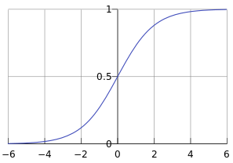

## 推荐系统冷启动的问题
### 冷启动问题简介
冷启动问题主要分3类：
* 用户冷启动
* 物品冷启动
* 系统冷启动
一些初步的解决方案：
* 提供非个性化推荐，热榜等
* 利用用户注册时的人口统计学信息做粗粒度分析
* 用户注册时，收集一些用户的兴趣爱好
### 利用用户注册信息
1. 人口统计学信息
2. 注册时用户兴趣描述
3. 从其他网站导入的用户信息
#### 基于用户注册信息

## 逻辑回归在推荐的应用
逻辑函数：
$$
g(z) = \frac{1}{1+e^{-z}}
$$

逻辑回归模型假设：
$$
P(y=1|x;\theta ) = g(\theta ^T x) = \frac{1}{1+e^{-\theta ^T x}}
$$
在推荐的模型中，$\theta$是样本的特征，x是样本在特征下的取值，实质上是将一个线性分类器做了一个非线性的映射，使得它的拟合能力更强了。简单的推荐场景下，假定1为用户的购买行为，0为用户未购买，对模型进行训练，不断更新$\theta$值，使得发生过购买行为的样本模型输出值接近1，未发生购买行为的样本模型输出值接近0，模型性能稳定之后，模型训练完成。预测的时候将预测样本的x值代入模型中，当结果大于某个人为设定的阙值时，我们就预测他会有购买行为，反之预测不会购买。