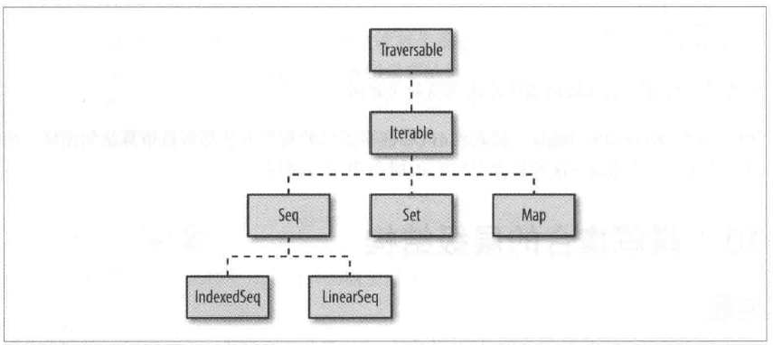
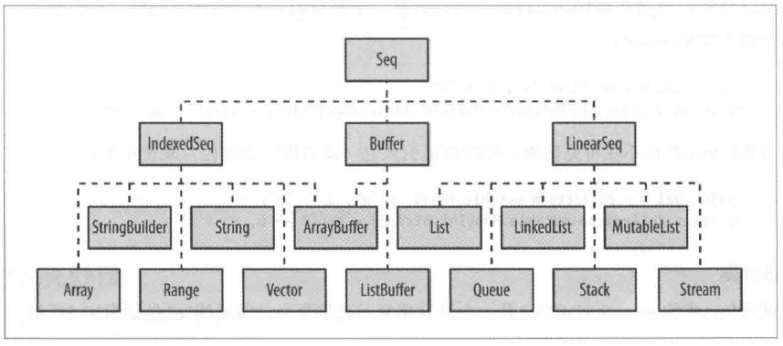

### case类的特点

case类会生成许多模板代码

1）会生成一个apply方法，可以不用new关键字来创建实例

2）构造函数的参数默认是val，自动生成访问方法

3）会生成一个默认toString方法

4）默认生成unapply方法，在模式匹配时很好用

5）生成equals和hashCode方法

6）生成copy方法

### 用Case类生成模板代码

模板代码包括了访问和修改方法，apply，unapply，toString，equals，hashCode等方法。

* 生成apply方法，可以不用new关键字创新实例。

  ```scala
  case class Person(name:String, relation:String)
  val emily = Person("Emily", "niece")
  ```

* 构造函数默认参数是val。

* 生成默认的toString方法。

* 生成一个unapply方法，在模式匹配时很好用。

  ```scala
  emily match{
      case Person(n, r) => println(n, r)
  }
  ```

* 生成equals和hashCode方法。

  ```
  val hannah = Person("Hannah", "niece")
  emily == hannah  //false
  ```

* 生成copy方法。

  ```scala
  val fred = emily.copy(name="fred")  //复制时，里面的变量可以改值
  ```

  

### 方法

#### 控制方法作用域

Scala可见行控制符

| 修饰符           | 描述                                   |
| ---------------- | -------------------------------------- |
| private[this]    | 对当前实例可见                         |
| private          | 对当前类多有实例可见                   |
| protected        | 对当前类及其子类的实例可见             |
| private[model]   | 对com.acme.coolapp.model包下所有类可见 |
| private[coolapp] | 对com.acme.coolapp包下所有类可见       |
| private[acme]    | 对com.acme包下所有类可见               |
| (无修饰符)       | 公开方法                               |

注：protected级别含义在Scala和Java中有所不同。在Java中，protected方法可以在同一个包中其它类访问，在Scala中是不可以的。下面代码无法编译，因为Jungle类不能访问Animal类的breathe方法，即使他们是在同一个包：

```scala
package world{
	class Animal{
		protected def breathe{}
	}
	class Jungle{
        val a = new Animal
        a.breathe  // error:this line won't compile
	}
}
```

#### 控制调用方法所属的特质

```scala
trait Human{
	def hello = "the Human trait"
}
trait Mother extends Human{
	override hello = "Mother"
}
trait Father extends Human{
	override hello = "Father"
}
class Child extends Human with Mother with Father{
	def printSuper = super.hello
	def printMother = super[Mother].hello
	def printFather = super[Father].hello
	def printHuman = super[Human].hello
}
```

#### 链式编码风格

* 如果类会被扩展，把this.type作为链式调用风格方法的返回值类型。
* 如果类不会被扩展，则把this从链式调用方法中返回出来。

```scala
class Person{
    var fname:String = ""
    var lname:String = ""
    def setFirstName(firstName:String):this.type = {
        this.fname = firstName
        this
    }
    def setLastName(lastName:String):this.type = {
        this.lname = lastName
        this
    }
}

class Person{
    var fname:String = ""
    var lname:String = ""
    def setFirstName(firstName:String) = {
        this.fname = firstName
        this
    }
    def setLastName(lastName:String) = {
        this.lname = lastName
        this
    }
    override def toString = {
        this.fname + this.lname
    }
}

object Main extends App{
    val p = Person
    println(p.setFirstName("z").setLastName("zx"))
}
```

### 限制特质使用范围

#### 通过继承来限制特质使用范围

```scala
class Animal

class Cat extends Animal {
  println("创建Cat实例")
}

trait Walk extends Cat

class SmallCat extends Cat with Walk {
  println("创建SmallCat实例")
}

object Demo extends App {
  val cat = new Cat with Walk
  val smallCat = new SmallCat
}
```

特质Walk继承了Cat类，则只有Cat类和Cat类的子类可以使用Walk特质。

#### 限定特质只能使用指定子类

和上面等价

```scala
class Animal

class Cat extends Animal {
  println("创建Cat实例")
}

trait Walk {
  this: Cat =>
}

class SmallCat extends Cat with Walk {
  println("创建SmallCat实例")
}

object Demo extends App {
  val cat = new Cat with Walk
  val smallCat = new SmallCat
}
```

#### 限定特质被添加必须实现特定方法

```scala
trait Walk{
  this: {def walk()} =>
}

class Animal extends Walk{
  def walk(): Unit ={
    println("walking")
  }
  def swim(): Unit = {
    println("swimming")
  }
}

object Demo extends App {
  val cat = new Animal
  cat.walk()
  cat.swim()
}
```

继承Walk的特质必须实现walk方法

#### 为实例对象添加特质

构造对象时混入日志

```scala
trait Debug{
  def log(): Unit ={
    println("打印日志")
  }
}

class Child

object Demo extends App {
  val child = new Child with Debug
  child.log()
}
```

### 集合

#### 基本概念

1）谓词

一个方法、函数或者匿名函数接受一个参数或者多个参数返回一个Boolean值。

```scala
def isEven(i: Int) = if (i % 2 == 0) true else false
```


2）匿名函数

```scala
(i: Int) => i % 2 == 0
```


3）隐式循环

```scala
val list = List.range(1, 10)
val events = list.filter(_ % 2 == 0)
```

#### 集合层级结构





索引序列IndexedSeq意味着随机存取效率是高效的，比如数组元素。

```scala
val x = IndexedSeq(1, 2, 3)
```

线性序列LinearSeq说明集合很方便的被分为头尾部分，并且用head，tail，和isEmpty方法是常见的。


```scala
val m = Map(1 -> "a", 2 -> "b")
val m = collection.mutable.Map(1 -> "a", 2 -> "b")
```


```scala
val set = Set(1, 2, 3)
val set = collection.mutable.Set(1, 2, 3)
```

