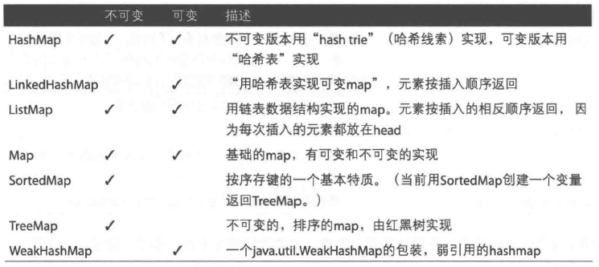

### case类的特点

case类会生成许多模板代码

1）会生成一个apply方法，可以不用new关键字来创建实例

2）构造函数的参数默认是val，自动生成访问方法

3）会生成一个默认toString方法

4）默认生成unapply方法，在模式匹配时很好用

5）生成equals和hashCode方法

6）生成copy方法

### 用Case类生成模板代码

模板代码包括了访问和修改方法，apply，unapply，toString，equals，hashCode等方法。

* 生成apply方法，可以不用new关键字创新实例。

  ```scala
  case class Person(name:String, relation:String)
  val emily = Person("Emily", "niece")
  ```

* 构造函数默认参数是val。

* 生成默认的toString方法。

* 生成一个unapply方法，在模式匹配时很好用。

  ```scala
  emily match{
      case Person(n, r) => println(n, r)
  }
  ```

* 生成equals和hashCode方法。

  ```
  val hannah = Person("Hannah", "niece")
  emily == hannah  //false
  ```

* 生成copy方法。

  ```scala
  val fred = emily.copy(name="fred")  //复制时，里面的变量可以改值
  ```

  

### 方法

#### 控制方法作用域

Scala可见行控制符

| 修饰符           | 描述                                   |
| ---------------- | -------------------------------------- |
| private[this]    | 对当前实例可见                         |
| private          | 对当前类多有实例可见                   |
| protected        | 对当前类及其子类的实例可见             |
| private[model]   | 对com.acme.coolapp.model包下所有类可见 |
| private[coolapp] | 对com.acme.coolapp包下所有类可见       |
| private[acme]    | 对com.acme包下所有类可见               |
| (无修饰符)       | 公开方法                               |

注：protected级别含义在Scala和Java中有所不同。在Java中，protected方法可以在同一个包中其它类访问，在Scala中是不可以的。下面代码无法编译，因为Jungle类不能访问Animal类的breathe方法，即使他们是在同一个包：

```scala
package world{
	class Animal{
		protected def breathe{}
	}
	class Jungle{
        val a = new Animal
        a.breathe  // error:this line won't compile
	}
}
```

#### 控制调用方法所属的特质

```scala
trait Human{
	def hello = "the Human trait"
}
trait Mother extends Human{
	override hello = "Mother"
}
trait Father extends Human{
	override hello = "Father"
}
class Child extends Human with Mother with Father{
	def printSuper = super.hello
	def printMother = super[Mother].hello
	def printFather = super[Father].hello
	def printHuman = super[Human].hello
}
```

#### 链式编码风格

* 如果类会被扩展，把this.type作为链式调用风格方法的返回值类型。
* 如果类不会被扩展，则把this从链式调用方法中返回出来。

```scala
class Person{
    var fname:String = ""
    var lname:String = ""
    def setFirstName(firstName:String):this.type = {
        this.fname = firstName
        this
    }
    def setLastName(lastName:String):this.type = {
        this.lname = lastName
        this
    }
}

class Person{
    var fname:String = ""
    var lname:String = ""
    def setFirstName(firstName:String) = {
        this.fname = firstName
        this
    }
    def setLastName(lastName:String) = {
        this.lname = lastName
        this
    }
    override def toString = {
        this.fname + this.lname
    }
}

object Main extends App{
    val p = Person
    println(p.setFirstName("z").setLastName("zx"))
}
```

### 限制特质使用范围

#### 通过继承来限制特质使用范围

```scala
class Animal

class Cat extends Animal {
  println("创建Cat实例")
}

trait Walk extends Cat

class SmallCat extends Cat with Walk {
  println("创建SmallCat实例")
}

object Demo extends App {
  val cat = new Cat with Walk
  val smallCat = new SmallCat
}
```

特质Walk继承了Cat类，则只有Cat类和Cat类的子类可以使用Walk特质。

#### 限定特质只能使用指定子类

和上面等价

```scala
class Animal

class Cat extends Animal {
  println("创建Cat实例")
}

trait Walk {
  this: Cat =>
}

class SmallCat extends Cat with Walk {
  println("创建SmallCat实例")
}

object Demo extends App {
  val cat = new Cat with Walk
  val smallCat = new SmallCat
}
```

#### 限定特质被添加必须实现特定方法

```scala
trait Walk{
  this: {def walk()} =>
}

class Animal extends Walk{
  def walk(): Unit ={
    println("walking")
  }
  def swim(): Unit = {
    println("swimming")
  }
}

object Demo extends App {
  val cat = new Animal
  cat.walk()
  cat.swim()
}
```

继承Walk的特质必须实现walk方法

#### 为实例对象添加特质

构造对象时混入日志

```scala
trait Debug{
  def log(): Unit ={
    println("打印日志")
  }
}

class Child

object Demo extends App {
  val child = new Child with Debug
  child.log()
}
```

### 函数式编程

##### 匿名函数

```scala
val x = List.range(1, 10)
val even = x.filter((i: Int) => i % 2 == 0)  // 声明Int可以去掉

// 等价
val even = x.filter(_ % 2 == 0)  // 允许使用"_"通配符替换变量名

// 如果一个函数只有一条语句，并且只有一个参数，那么参数不需要特别指定
x.foreach(println)
```

##### 将函数作为变量

**=>**可以看做是一个转换器

```scala
val double = (i: Int) => {i * 2}
val list = List.range(1, 5)

list.map(double)
```

###### 像匿名函数一样使用方法

```scala
def modMethod(i: Int) = i % 2 == 0
val list = List.range(1, 10)
list.filter(modMethod)
```

###### 给已存在的方法或者函数赋给函数变量

```scala
val c = scala.math.cos _  // 单个变量
val p = scala.math.pow(_, _) // 多个变量
val p = scala.math.pow _  // 等价上面那个
```

##### 定义简单的函数作为参数的方法

1）定义方法，包括期望接受的函数参数的签名

2）定义满足这个签名的一个或多个函数

3）将函数作为参数传递给方法

```scala
def executeFunction(callback:() => Unit){
    callback()
}
val sayHello = () => {println("Hello")}
executeFunction(sayHello)

// 两种签名等价
executeFunction(f:String => Int)
executeFunction(f:(String) => Int)
```

###### 传入函数外的其他参数

```scala
def executeXTimes(callback:() => Unit, numTimes: Int){
	for(i <- 1 to numTimes) callback()
}
```

##### 使用部分应用函数

创建一个函数并且预加载一些值

```scala
val sum = (a: Int, b: Int, c: Int) => a + b +c
val f = sum(1, 2, _: Int)
val f = sum(1, _: Int, _: Int)
```

##### 创建返回函数的函数

```scala
def saySomething(prefix: String) = (s: String) => {
    prefix + " " + s
}
```

##### 偏函数

偏函数(Partial Function)，是一个数学概念它不是"函数"的一种, 它跟函数是平行的概念。
 Scala中的Partia Function是一个Trait，其的类型为PartialFunction[A,B]，其中接收一个类型为A的参数，返回一个类型为B的结果。

```scala
val pf: PartialFunction[Int, String] = {
    case 1 => "One"
    case 2 => "Two"
    case _ => "Other"
}  // 使用case可以快速定义偏函数，{}+case

// 偏函数内部有一些方法，比如isDefinedAt、OrElse、 andThen、applyOrElse
pf.isDefinedAt(1)  // 判断偏函数传入的参数是否在偏函数的范围

// 重写isDefinedAt方法
val divide = new PartialFunction[Int, Int] {
    def apply(x: Int) = 42 / x
    def isDefinedAt(x: Int) = x != 0
}

def fun: PartialFunction[Int, String] = {
    case 1 => "one"
}
```


### 集合

#### 基本概念

1）谓词

一个方法、函数或者匿名函数接受一个参数或者多个参数返回一个Boolean值。

```scala
def isEven(i: Int) = if (i % 2 == 0) true else false
```


2）匿名函数

```scala
(i: Int) => i % 2 == 0
```


3）隐式循环

```scala
val list = List.range(1, 10)
val events = list.filter(_ % 2 == 0)
```

#### 集合层级结构


#### 不可变序列


##### Array&Vector

```scala
// 快速创建Array方法，Vector也可以用
val x = Array.range(1, 10)
val x = Array.fill(3)("foo")
val x = Array.tabulate(5)(_*2)
val x = List(1, 2, 3).toArray

// Array数组大小不能改变，所以不能删除元素，但是能改变元素的值
x(0) = 10

x.slice(1, 10)  // 第1到第10个元素

// 排序
scala.util.Sorting.quickSort(x)

// 创建多维数组
val x = Array.ofDim[String](2, 3)
x(0)(0) = "a"
x(0)(1) = "b"
// 或者
val x = Array(Array(1, 2, 3), Array(4, 5, 6))
```

#### 可变序列1


#### 可变序列2


##### ArrayBuffer

```scala
val x = ArrayBuffer[String]()
x += "Ben"
x += ("Dale", "Harry")
x += Seq("Gordon", "Big Ed")
x.append("Laura", "Lucy")

x -= "Ben"
x -= ("Dale", "Harry")
x --= Seq("Gordon", "Big Ed")
x --= Array("a")
x --= Set("a")
x.remove(0)
x.clear
```


#### Map



```scala
// 可变map
import collection.mutable.{Map => MMap}
val m = MMap[String, String]()
m += ("AL" -> "Alabama")
m -= "AL"
m("AK") = "Alaska"
m -= ("AL", "AZ")
// 从另一个集合添加多个元素
m ++= List("CA" -> "California", "CO" -> "Colorado")  // 通过List嵌套元组的添加Map元素
m ++= List(("CA", "California"), ("CO", "Colorada"))

// 有序map
import collection.SortedMap
val map = SortedMap("Kim"->90, "Al"->91)

// 线性Map，LinkedHashMap或者ListMap，只有LinkedHashMap是可变的

// 过滤keys
val map.retain((k, v)=>k=="Ak")
map.filterKeys(_ > 2)
map.filter((t) => t._1 >2)  // 这个key和value都能过滤

// 请求Map中没有的键值
val map = Map("AL" -> "Alabama").withDefaultValue("Not Found")
map.getOrElse("FOO", "No such value")

 // 返回Option对象
val x = map.get("AL")

// 遍历map的三种方法
for((k, v)<-map){
	println(s"key:$k, value:$v")
}
map.foreach{
    case(k, v) => println(s"key:$k, value:$v")
}
map.foreach(x => println(s"key:${x._1}, value:${x._2}"))

// 遍历keys
map.keys.foreach((x) => println)

// 遍历values
map.mapValues(_.toUpperCase)

// 获取所有keys或者values
map.keys
map.values

// 反转键值
for((k, v) <- map){
    yield(v, k)
}

// 是否包含某个key
map.contains("FOO")
// 是否包含某个value
map.valuesIterator.exists(_.contains("FOO"))  // 值中是否存在字串"FOO"
```

##### Map中最大的键值或者值

```scala
val map = Map("AL"->80, "Kim"->95, "Teri"->85, "Julia"->90)
map.max
map.keysIterator.max
map.valuesIterator.reduceLeft((x, y) => if (x > y) x else y)
map.valuesIterator.reduceLeft(_ max _)
```


#### Set


#### 元组

```scala
// 创建元组，元组可以包含不同类型的元素
val x = (1, 2, 3, 4, "hello")
// 创建两个元素的元组
val x = 1 -> "a"

// 通过下划线来访问
x._1

// 使用可排序集，SortedSet是不可变版本，可变版本是java.util.TreeSet
val s = scala.collection.SortedSet(10, 4, 8, 2)

// 自定义类实现排序
class Person(var name: String) extends Ordered[Person]{
    def compare(that:Person) = {
        if(this.name==that.name)
        	0
        else if(this.name > that.name)
        	1
        else
        	-1
    }
}
```

#### 排序

##### _*变长参数

```scala
def printAll(strings: String*){
	strings.foreach(println)
}
val fruits = List("Apple", "Banana", "Cherry")
// 该List无法传入printAll，但是_*可以调整List，让它可以用于printAll
printAll(fruits:_*)  // _*操作符将序列的每个元素作为单独的参数传递给printAll
```

##### 用变长参数将排序后的Seq传递给ListMap

```scala
val x = Map("A"->"Apple", "B"->"Banana", "C"->"Cherry")

// 两种排序
val seq = x.toSeq.sortBy(_._1)
val seq = x.toSeq.sortWith(_._1 < _._1)
ListMap(seq:_*)  // 将seq进行数据转换，将其作为多个参数传递给ListMap或者LinkedHashMap

// 简单排序
val x = List(2, 1, 4, 5)
x.sorted
```

#### Range

```scala
1 to 10
1 until 10
1 to 10 by 2

// 快速创建
val x = (1 to 10).toList
val x = (1 to 10).toArray
val x = (1 to 10).toSet

val x = List.range(1, 10)
```

#### 集合常用操作

```scala
// for/yield结构
val fruits = Array("apple", "banana", "orange")
val newArray = for(e <- fruits) yield e.toUpperCase  // yield也可以作用在一个代码块中

// zipWithIndex或者zip创建循环计数器
val days = Array("Sunday", "Monday", "Tuesday", "Webnesday")
days.zipWithIndex.foreach{
    case(day, count) => println(s"$count is $day")
}
//或者
days.zipWithIndex.foreach{
    d => println(s"${d._2} is ${d._1}")
}

// 迭代器
val it = Iterator(1, 2, 3)
it.foreach(prinln)

// 分割序列
val x = List(1, 2, 3, 4, 5)
val group = x.groupBy(_ > 3)  // Map(false -> List(1, 2, 3), true -> List(4, 5))
// 访问
group(true) 
//或者
group(false)
x.partition(_ > 3)  // (List(4, 5),List(1, 2, 3))
x.span(_ < 3)  // (List(4, 5),List(1, 2, 3))
x.splitAt(2)  // (List(4, 5),List(1, 2, 3))

// zip和unzip
val women = List("Kim", "Julia")
val men = List("Al", "Terry")
val couples = women zip men  // List((Kim,Al), (Julia,Terry))
val (women, men) = couples.unzip

// reduceLeft
val x = Array(1, 2, 3)
x.reduceLeft(_ + _)
x.reduceLeft((x, y) => x + y)
x.foldLeft(10)(_ + _)

// scanLeft相对于reduceLeft它返回的是一个集合
x.scanLeft(10)(_ * _) // List(10, 10, 20, 60)

// 序列中去重distinct
val x = Vector(1, 1, 2, 3, 4)
x.distinct
x.toSet

// 在自定义类中实现distinct需要实现equals和hashCode方法

// 合并序列集合
val a = Array(1, 2, 3)
val b = Array(4, 5, 6)
a ++= b
a.intersect(b)
a.union(b)
a diff b

// 集合转字符串
val a = Array("apple", "banana", "cherry")
a.mkString
a.mkString(" ")  // apple banana cherry
a.mkString("[", ",", "]")  // 加上前缀、间隔和后缀
```

### 类型

scala使用型变、边界和约束来表示泛型类型。

#### 型变


```scala
class Grandparent
class Parent extends Grandparent
class Child extends Parent

class InvariantClass[A]
class CovariantClass[+A]
class Contravariant[-A]

class VarianceExample {
  def invarFunc(x: InvariantClass[Parent])
  def covarFunc(x: CovariantClass[Parent])
  def contraFunc(x: Contravariant[Parent])

  invarFunc(new InvariantClass[Child]) // won't compile
  invarFunc(new InvariantClass[Parent]) // success
  invarFunc(new InvariantClass[Grandparent]) // won't compile

  covarFunc(new Contravariant[Child]) // success
  covarFunc(new Contravariant[Parent]) // success
  covarFunc(new Contravariant[Grandparent]) // won't compile

  contraFunc(new Contravariant[Child]) // won't compile
  contraFunc(new Contravariant[Parent]) // success
  contraFunc(new Contravariant[Grandparent]) // success
}
```

#### 边界


```  scala
A =:= B  // A must be equal to B
A <:< B  // A must be a subtype of B
```

#### 泛型类

```scala
class Node[A]

class Animal
class Cat extends Animal
class Dog extends Animal

class LinkedList[A, T] {
  private val array = new ArrayBuffer[A]()
  private val arrayNode = new ArrayBuffer[Node[T]]()
  def add(a: A): Unit = {
    array.append(a)
  }

  def addNode(node: Node[T]): Unit = {
    arrayNode.append(node)
  }

  def printArray(): Unit = {
    println(array.toString())
  }

  def printNode(): Unit = {
    println(arrayNode.toString())
  }
}

object Demo extends App {
  val array = new LinkedList[String, Animal]
  array.add("A")
  array.add("B")
  array.addNode(new Node[Animal])
  array.addNode(new Node[Cat])  // 这里won't compile，需要把T改成+T
  array.printArray()
  array.printNode()
}
```

#### 泛型方法

```scala
object test {
  def printElem[A](seq: Seq[A]) {
    seq.foreach(println(_))
  }
}

object Demo extends App {
  val s = Seq(1, 2, 3, 4)
  test.printElem(s)
}
```

#### 鸭子类型(结构化类型)

```scala
def callSpeak[A <: { def speak(): Unit }](obj: A) {
    obj.speak()
}
```

该方法传入的对象需要实现了speak方法。

