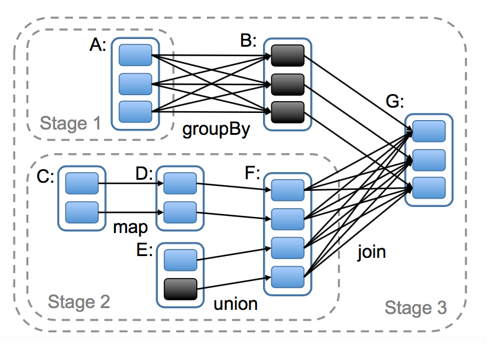
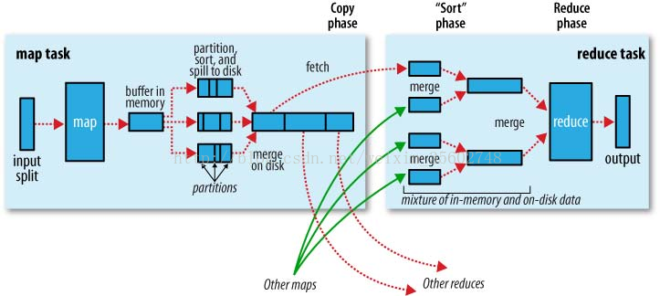
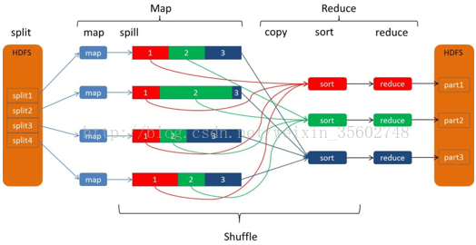
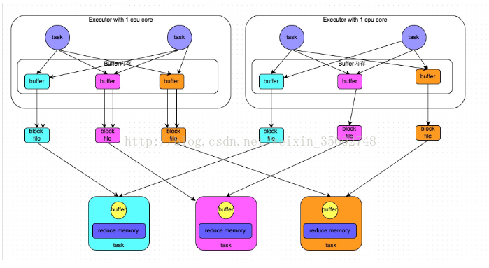
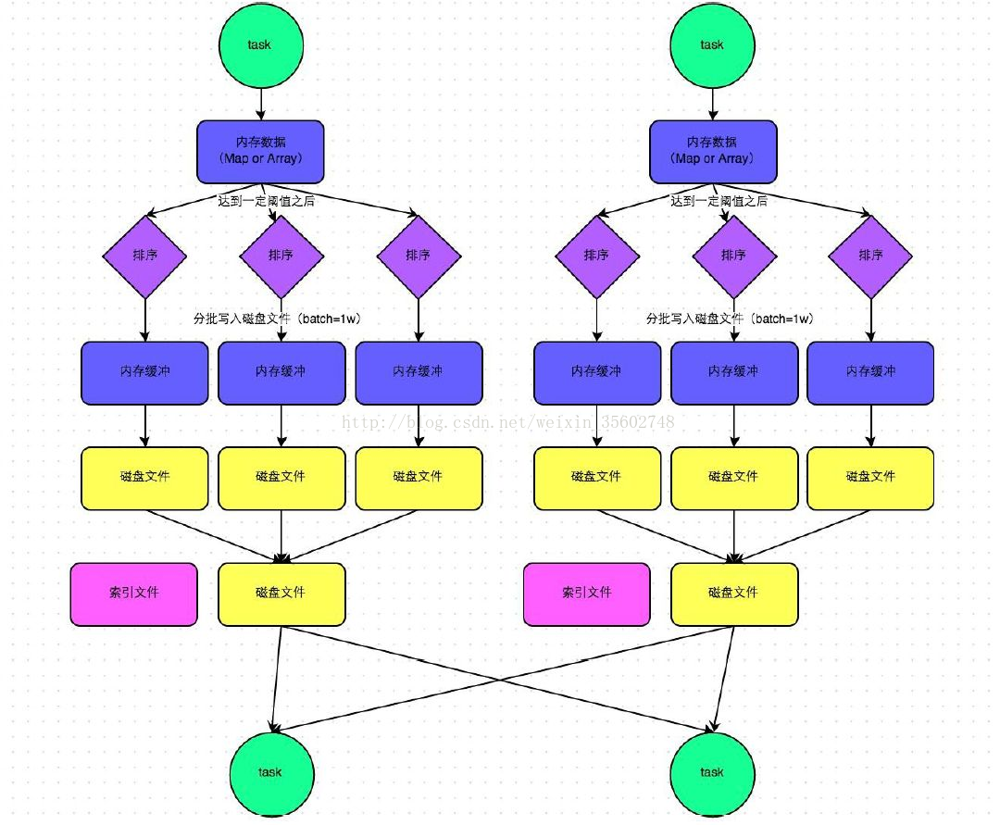
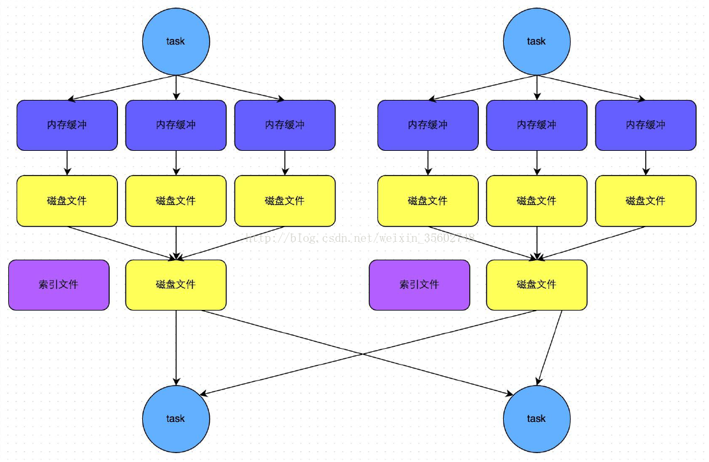

# 配置idea
## 配置scala
1. 在File-->Settings-->Plugins搜索安装scala插件，可以离线安装
2. 配置jdk
3. 在File-->Project Structure  
Global Libraries添加scala-sdk-2.11.12  
Libraries添加scala-sdk-2.11.12
## maven环境
1. 建立maven环境、
2. Settings中搜索Maven，在Maven home directory目录的settings.xml中添加阿里源
3. 在pom.xml中添加dependency以来，注意对应版本
4. 如果maven插件没有自动下载依赖，右键pom.xml文件，选择maven-->Reimport

# spark
## Quick start
```
package main.scala
import org.apache.spark.sql.SparkSession

object test {
    def main(args: Array[String]): Unit = {
        val file = "E:\\项目\\testmaven\\src\\main\\resources\\README.md"
        val spark = SparkSession.builder.appName("Simple Application").getOrCreate()
        val logData = spark.read.textFile(file)
        val countA = logData.filter(line => line.contains("a")).count()
        println(s"包含a的行有${countA}个.")
        spark.close()
    }
}
```
报错：A master URL must be set in your configuration，需要在配置文件中的VM options选项中设置-Dspark.master=local。
## RDDs，Accumulators，Broadcasts Vars
### RDDS
#### Parallelized Collections
Parallelized collections are created by calling SparkContext’s parallelize method on an existing collection in your driver program.
```
val conf = new SparkConf().setAppName(appName).setMaster(master)
val sc = new SparkContext(conf)
val data = Array(1, 2, 3, 4, 5)
val distData = sc.parallelize(data)
```
注意：有个重要的参数，partitions可以人工指定，sc.parallelize(data, 10)，指定将dataset分为几个部分。
#### External Datasets
Spark can create distributed datasets from any storage source supported by Hadoop, including your local file system, HDFS, Cassandra, HBase, Amazon S3, etc.
```
val distFile = sc.textFile("data.txt")
```
Some notes on reading files with Spark:
* All of Spark’s file-based input methods, including textFile, support running on directories, compressed files, and wildcards as well. For example, you can use textFile("/my/directory"), textFile("/my/directory/*.txt"), and textFile("/my/directory/*.gz").
* The textFile method also takes an optional second argument for controlling the number of partitions of the file. By default, Spark creates one partition for each block of the file (blocks being 128MB by default in HDFS), but you can also ask for a higher number of partitions by passing a larger value. Note that you cannot have fewer partitions than blocks.
#### RDD Operations
RDDs support two types of operations: $transformations$, which create a new dataset from an existing one, and $actions$, which return a value to the driver program after running a computation on the dataset.  

All transformations in Spark are lazy, in that they do not compute their results right away. Instead, they just remember the transformations applied to some base dataset (e.g. a file). The transformations are only computed when an action requires a result to be returned to the driver program.   

By default, each transformed RDD may be recomputed each time you run an action on it. However, you may also persist an RDD in memory using the persist (or cache) method, in which case Spark will keep the elements around on the cluster for much faster access the next time you query it. There is also support for persisting RDDs on disk, or replicated across multiple nodes.
#### Basics
```
val lines = sc.textFile("data.txt")
val lineLengths = lines.map(x => x.length)
val totalLenght = lineLengths.reduce((a, b)=>a+b)
```
If we also wanted to use lineLengths again later, we could add:
```
lineLengths.persist()
```
before the reduce, which would cause lineLengths to be saved in memory after the first time it is computed.
## Spark中的序列化机制
在写Spark的应用时，尝尝会碰到序列化的问题。例如，在Driver端的程序中创建了一个对象，而在各个Executor中会用到这个对象 —— 由于Driver端代码与Executor端的代码运行在不同的JVM中，甚至在不同的节点上，因此必然要有相应的序列化机制来支撑数据实例在不同的JVM或者节点之间的传输。

## RDD的宽窄依赖


窄依赖，表示父亲 RDDs 的一个分区最多被子 RDDs 一个分区所依赖。宽依赖，表示父亲 RDDs 的一个分区可以被子 RDDs 的多个子分区所依赖。比如，map 操作是一个窄依赖，join 操作是一个宽依赖操作（除非父亲 RDDs 已经被 hash 分区过）。

每一个方框表示一个 RDD，带有颜色的矩形表示分区。以下两个原因使的这种区别很有用，第一，窄依赖可以使得在集群中一个机器节点的执行流计算所有父亲的分区数据，比如，我们可以将每一个元素应用了 map 操作后紧接着应用 filter 操作，与此相反，宽依赖需要父亲 RDDs 的所有分区数据准备好并且利用类似于 MapReduce 的操作将数据在不同的节点之间进行重新洗牌和网络传输。第二，窄依赖从一个失败节点中恢复是非常高效的，因为只需要重新计算相对应的父亲的分区数据就可以，而且这个重新计算是在不同的节点进行并行重计算的，与此相反，在一个含有宽依赖的血缘关系 RDDs 图中，一个节点的失败可能导致一些分区数据的丢失，但是我们需要重新计算父 RDD 的所有分区的数据。

- HDFS files：抽样的输入 RDDs 是 HDFS 中的文件。对于这些 RDDs，partitions 返回文件中每一个数据块对应的一个分区信息（数据块的位置信息存储在 Partition 对象中），preferredLocations 返回每一个数据块所在的机器节点信息，最后 iterator 负责数据块的读取操作。
- map：对任意的 RDDs 调用 map 操作将会返回一个 MappedRDD 对象。这个对象含有和其父亲 RDDs 相同的分区信息和数据存储节点信息，但是在 iterator 中对父亲的所有输出数据记录应用传给 map 的函数。
- union：对两个 RDDs 调用 union 操作将会返回一个新的 RDD，这个 RDD 的分区数是他所有父亲 RDDs 的所有分区数的总数。每一个子分区通过相对应的窄依赖的父亲分区计算得到。
- sample：sampling 和 mapping 类似，除了 sample RDD 中为每一个分区存储了一个随机数，作为从父亲分区数据中抽样的种子。
- join：对两个 RDDs 进行 join 操作，可能导致两个窄依赖（如果两个 RDDs 都是事先经过相同的 hash/range 分区器进行分区），或者导致两个宽依赖，或者一个窄依赖一个宽依赖（一个父亲 RDD 经过分区而另一个没有分区）。在上面所有的恶场景中，join 之后的输出 RDD 会有一个 partitioner（从父亲 RDD 中继承过来的或者是一个默认的 hash partitioner）
## job调度器
当一个用户对某个 RDD 调用了 action 操作（比如 count 或者 save）的时候调度器会检查这个 RDD 的血缘关系图，然后根据这个血缘关系图构建一个含有 stages 的有向无环图（DAG），最后按照步骤执行这个 DAG 中的 stages，如图 5 的说明。每一个 stage 包含了尽可能多的带有窄依赖的 transformations 操作。这个 stage 的划分是根据需要 shuffle 操作的宽依赖或者任何可以切断对父亲 RDD 计算的某个操作（因为这些父亲 RDD 的分区已经计算过了）。然后调度器可以调度启动 tasks 来执行没有父亲 stage 的 stage（或者父亲 stage 已经计算好了的 stage），一直到计算完我们的最后的目标 RDD 。



spark job stage 的例子。实线的方框表示 RDDs ，带有颜色的方形表示分区，黑色的是表示这个分区的数据存储在内存中，对 RDD G 调用 action 操作，我们根据宽依赖生成很多 stages，且将窄依赖的 transformations 操作放在 stage 中。在这个场景中，stage 1 的输出结果已经在内存中，所以我们开始运行 stage 2，然后是 stage 3。

我们调度器在分配 tasks 的时候是采用延迟调度来达到数据本地性的目的（说白了，就是数据在哪里，计算就在哪里）。如果某个分区的数据在某个节点上的内存中，那么将这个分区的计算发送到这个机器节点中。如果某个 RDD 为它的某个分区提供了这个数据存储的位置节点，则将这个分区的计算发送到这个节点上。
## shuffle详解
[参考](https://www.cnblogs.com/itboys/p/9226479.html)
### shuffle简介
Shuffle描述着数据从map task输出到reduce task输入的这段过程。shuffle是连接Map和Reduce之间的桥梁，Map的输出要用到Reduce中必须经过shuffle这个环节，shuffle的性能高低直接影响了整个程序的性能和吞吐量。因为在分布式情况下，reduce task需要跨节点去拉取其它节点上的map task结果。这一过程将会产生网络资源消耗和内存，磁盘IO的消耗。通常shuffle分为两部分：Map阶段的数据准备和Reduce阶段的数据拷贝处理。一般将在map端的Shuffle称之为Shuffle Write，在Reduce端的Shuffle称之为Shuffle Read.
### Hadoop MapReduce Shuffle
Apache Spark 的 Shuffle 过程与 Apache Hadoop 的 Shuffle 过程有着诸多类似，一些概念可直接套用，例如，Shuffle 过程中，提供数据的一端，被称作 Map 端，Map 端每个生成数据的任务称为 Mapper，对应的，接收数据的一端，被称作 Reduce 端，Reduce 端每个拉取数据的任务称为 Reducer，Shuffle 过程本质上都是将 Map 端获得的数据使用分区器进行划分，并将数据发送给对应的 Reducer 的过程。

map端的Shuffle简述:  
1. input, 根据split输入数据，运行map任务。 默认一个split分配一个map，一个split大小等于一个block大小。想要是把map的数量多一点，也就是得到比块小的切片，就设置 maxSize的值 比块小的值；想要map的数量少一点，则设置minSize的值 比块大的值 ；
2. patition, 每个map task都有一个内存缓冲区，存储着map的输出结果;
3. spill, 当缓冲区快满的时候需要将缓冲区的数据以临时文件的方式存放到磁盘;
4. merge, 当整个map task结束后再对磁盘中这个map task产生的所有临时文件做合并，生成最终的正式输出文件，然后等待reduce task来拉数据。  
reduce 端的Shuffle简述:  
reduce task在执行之前的工作就是不断地拉取当前job里每个map task的最终结果，然后对从不同地方拉取过来的数据不断地做merge，也最终形成一个文件作为reduce task的输入文件。
1. Copy过程，拉取数据。
2. Merge阶段，合并拉取来的小文件
3. Reducer计算
4. Output输出计算结果
shuffle数据流：

map端，有4个map;Reduce端，有3个reduce。4个map 也就是4个JVM，每个JVM处理一个数据分片(split1~split4)，每个map产生一个map输出文件，但是每个map都为后面的reduce产生了3部分数据(分别用红1、绿2、蓝3标识)，也就是说每个输出的map文件都包含了3部分数据。mapper运行后，通过Partitioner接口，根据key或value及reduce的数量来决定当前map的输出数据最终应该交由哪个reduce task处理.Reduce端一共有3个reduce，去前面的4个map的输出结果中抓取属于自己的数据。

### spark shuffle
#### Hash shuffle
HashShuffleManager的运行机制主要分成两种，一种是普通运行机制，另一种是合并的运行机制。

这里我们先明确一个假设前提：每个Executor只有1个CPU core，也就是说，无论这个Executor上分配多少个task线程，同一时间都只能执行一个task线程。图中有3个 Reducer，从Task 开始那边各自把自己进行 Hash 计算(分区器：hash/numreduce取模)，分类出3个不同的类别，每个 Task 都分成3种类别的数据，想把不同的数据汇聚然后计算出最终的结果，所以Reducer 会在每个 Task 中把属于自己类别的数据收集过来，汇聚成一个同类别的大集合，每1个 Task 输出3份本地文件，这里有4个 Mapper Tasks，所以总共输出了4个 Tasks x 3个分类文件 = 12个本地小文件。
1. shuffle write阶段
主要就是在一个stage结束计算之后，为了下一个stage可以执行shuffle类的算子(比如reduceByKey，groupByKey)，而将每个task处理的数据按key进行“分区”。所谓“分区”，就是对相同的key执行hash算法，从而将相同key都写入同一个磁盘文件中，而每一个磁盘文件都只属于reduce端的stage的一个task。在将数据写入磁盘之前，会先将数据写入内存缓冲中，当内存缓冲填满之后，才会溢写到磁盘文件中去。

那么每个执行shuffle write的task，要为下一个stage创建多少个磁盘文件呢?很简单，下一个stage的task有多少个，当前stage的每个task就要创建多少份磁盘文件。比如下一个stage总共有100个task，那么当前stage的每个task都要创建100份磁盘文件。如果当前stage有50个task，总共有10个Executor，每个Executor执行5个Task，那么每个Executor上总共就要创建500个磁盘文件，所有Executor上会创建5000个磁盘文件。由此可见，未经优化的shuffle write操作所产生的磁盘文件的数量是极其惊人的。
2：shuffle read阶段
shuffle read，通常就是一个stage刚开始时要做的事情。此时该stage的每一个task就需要将上一个stage的计算结果中的所有相同key，从各个节点上通过网络都拉取到自己所在的节点上，然后进行key的聚合或连接等操作。由于shuffle write的过程中，task给Reduce端的stage的每个task都创建了一个磁盘文件，因此shuffle read的过程中，每个task只要从上游stage的所有task所在节点上，拉取属于自己的那一个磁盘文件即可。

shuffle read的拉取过程是一边拉取一边进行聚合的。每个shuffle read task都会有一个自己的buffer缓冲，每次都只能拉取与buffer缓冲相同大小的数据，然后通过内存中的一个Map进行聚合等操作。聚合完一批数据后，再拉取下一批数据，并放到buffer缓冲中进行聚合操作。以此类推，直到最后将所有数据到拉取完，并得到最终的结果。
#### Hash shuffle普通机制的问题
合并机制就是复用buffer，开启合并机制的配置是spark.shuffle.consolidateFiles。该参数默认值为false，将其设置为true即可开启优化机制。通常来说，如果我们使用HashShuffleManager，那么都建议开启这个选项。

开启consolidate机制之后，在shuffle write过程中，task就不是为下游stage的每个task创建一个磁盘文件了。此时会出现shuffleFileGroup的概念，每个shuffleFileGroup会对应一批磁盘文件，磁盘文件的数量与下游stage的task数量是相同的。一个Executor上有多少个CPU core，就可以并行执行多少个task。而第一批并行执行的每个task都会创建一个shuffleFileGroup，并将数据写入对应的磁盘文件内。

Executor的CPU core执行完一批task，接着执行下一批task时，下一批task就会复用之前已有的shuffleFileGroup，包括其中的磁盘文件。也就是说，此时task会将数据写入已有的磁盘文件中，而不会写入新的磁盘文件中。因此，consolidate机制允许不同的task复用同一批磁盘文件，这样就可以有效将多个task的磁盘文件进行一定程度上的合并，从而大幅度减少磁盘文件的数量，进而提升shuffle write的性能。

假设第二个stage有100个task，第一个stage有50个task，总共还是有10个Executor，每个Executor执行5个task。那么原本使用未经优化的HashShuffleManager时，每个Executor会产生500个磁盘文件，所有Executor会产生5000个磁盘文件的。但是此时经过优化之后，每个Executor创建的磁盘文件的数量的计算公式为：CPU core的数量 * 下一个stage的task数量。也就是说，每个Executor此时只会创建100个磁盘文件，所有Executor只会创建1000个磁盘文件。
### sort shuffle
SortShuffleManager的运行机制主要分成两种，一种是普通运行机制，另一种是bypass运行机制。当shuffle read task的数量小于等于spark.shuffle.sort.bypassMergeThreshold参数的值时(默认为200)，就会启用bypass机制。

1. 写入内存数据结构  
该图说明了普通的SortShuffleManager的原理。在该模式下，数据会先写入一个内存数据结构中(默认5M)，此时根据不同的shuffle算子，可能选用不同的数据结构。如果是reduceByKey这种聚合类的shuffle算子，那么会选用Map数据结构，一边通过Map进行聚合，一边写入内存;如果是join这种普通的shuffle算子，那么会选用Array数据结构，直接写入内存。接着，每写一条数据进入内存数据结构之后，就会判断一下，是否达到了某个临界阈值。如果达到临界阈值的话，那么就会尝试将内存数据结构中的数据溢写到磁盘，然后清空内存数据结构。  
注意：
shuffle中的定时器：定时器会检查内存数据结构的大小，如果内存数据结构空间不够，那么会申请额外的内存，申请的大小满足如下公式：  
applyMemory=nowMenory*2-oldMemory
申请的内存=当前的内存情况*2-上一次的内嵌情况  
意思就是说内存数据结构的大小的动态变化，如果存储的数据超出内存数据结构的大小，将申请内存数据结构存储的数据*2-内存数据结构的设定值的内存大小空间。申请到了，内存数据结构的大小变大，内存不够，申请不到，则发生溢写
2. 排序  
在溢写到磁盘文件之前，会先根据key对内存数据结构中已有的数据进行排序。  
3. 溢写  
排序过后，会分批将数据写入磁盘文件。默认的batch数量是10000条，也就是说，排序好的数据，会以每批1万条数据的形式分批写入磁盘文件。写入磁盘文件是通过Java的BufferedOutputStream实现的。BufferedOutputStream是Java的缓冲输出流，首先会将数据缓冲在内存中，当内存缓冲满溢之后再一次写入磁盘文件中，这样可以减少磁盘IO次数，提升性能。
4. merge  
一个task将所有数据写入内存数据结构的过程中，会发生多次磁盘溢写操作，也就会产生多个临时文件。最后会将之前所有的临时磁盘文件都进行合并，这就是merge过程，此时会将之前所有临时磁盘文件中的数据读取出来，然后依次写入最终的磁盘文件之中。此外，由于一个task就只对应一个磁盘文件，也就意味着该task为Reduce端的stage的task准备的数据都在这一个文件中，因此还会单独写一份索引文件，其中标识了下游各个task的数据在文件中的start offset与end offset。

SortShuffleManager由于有一个磁盘文件merge的过程，因此大大减少了文件数量。比如第一个stage有50个task，总共有10个Executor，每个Executor执行5个task，而第二个stage有100个task。由于每个task最终只有一个磁盘文件，因此此时每个Executor上只有5个磁盘文件，所有Executor只有50个磁盘文件。

bypass运行机制的触发条件如下：  
1)shuffle map task数量小于spark.shuffle.sort.bypassMergeThreshold参数的值。  
2)不是聚合类的shuffle算子(比如reduceByKey)。

此时task会为每个reduce端的task都创建一个临时磁盘文件，并将数据按key进行hash然后根据key的hash值，将key写入对应的磁盘文件之中。当然，写入磁盘文件时也是先写入内存缓冲，缓冲写满之后再溢写到磁盘文件的。最后，同样会将所有临时磁盘文件都合并成一个磁盘文件，并创建一个单独的索引文件。

该过程的磁盘写机制其实跟未经优化的HashShuffleManager是一模一样的，因为都要创建数量惊人的磁盘文件，只是在最后会做一个磁盘文件的合并而已。因此少量的最终磁盘文件，也让该机制相对未经优化的HashShuffleManager来说，shuffle read的性能会更好。

而该机制与普通SortShuffleManager运行机制的不同在于：  
第一，磁盘写机制不同;  
第二，不会进行排序。也就是说，启用该机制的最大好处在于，shuffle write过程中，不需要进行数据的排序操作，也就节省掉了这部分的性能开销。

### spark df中的map

如果要行数据进行比较复杂的操作，需要将DF先转成RDD，最后完成之后再将RDD转回DF。

```scala
case class Spu(categorycode2: String, spucode: String, nums: BigInt, store_code: String, day_night: String, count: BigInt)
// 将count值小于6的categorycode2赋值为"xxx"
val df2RDD = df.as[Spu].rdd
        val resDF = df2RDD.map(row => {
            if (row.count < 6)
                Spu("xxx", row.spucode, row.nums, row.store_code, row.day_night, row.count)
            else
                row
        }).toDF()
        resDF

```

或者采用sql的一些表达方式处理dataframe

```scala
df = mergeDF.selectExpr("store_code", "day_night", "if(count>=6, categorycode2, 'xxx') as categorycode2", "spucode", "nums", "count")  //每个字符串代表一个字段，里面可以加入一些sparksql自带的函数进行处理
```

# Spark应用

## 创建RDD、DF、DS

```scala
import org.apache.spark.sql.SparkSession

// 创建RDD
val conf = new SparkConf().setAppName("App").setMaster("local[4]")
val sc = new SparkContext(conf)
sc.textFile("data.txt")

rdd = sc.parallelize(Seq("zzx", "cfj", "xmh", "zll"))

val peopleRDD: RDD[String] = spark.sparkContext.textFile("E:\\project\\learn\\src\\main\\resources\\people.txt")


// 创建Dataframe
val spark = SparkSession
        .builder()
        .appName("zzxApp")
        .master("local[6]")
        .getOrCreate()
val df = spark.read.json("people.json")

val df = Seq(("zzx", 10, "female"), ("cfj", 8, "male")).toDF("name", "age", "sex")

// 创建Dataset
case class Person(name: String, age: Long)
val ds = Seq(Person("zzx", 10)).toDS()

val peopleDS = spark.read.json("people.json").toDS()  // DF转DS

val peopleDS = spark.read.json("people.json").as[Person]  // DF转DS

// RDD转DF Inferring the Schema Using Reflection

// RDD转DF Programmatically Specifying the Schema
val peopleRDD: RDD[String] = spark.sparkContext.textFile("E:\\project\\learn\\src\\main\\resources\\people.txt")
val schemaString = "name age"
val fields: Array[StructField] = schemaString.split(" ").map(fieldName => StructField(fieldName,
    StringType, nullable = true))
val schema: StructType = StructType(fields)
val rowRDD: RDD[Row] = peopleRDD.map(_.split(",")).map(x => Row(x(0), x(1).trim()))
val peopleDF = spark.createDataFrame(rowRDD, schema)
peopleDF.show()
peopleRDD.map(_.split(","))
```

