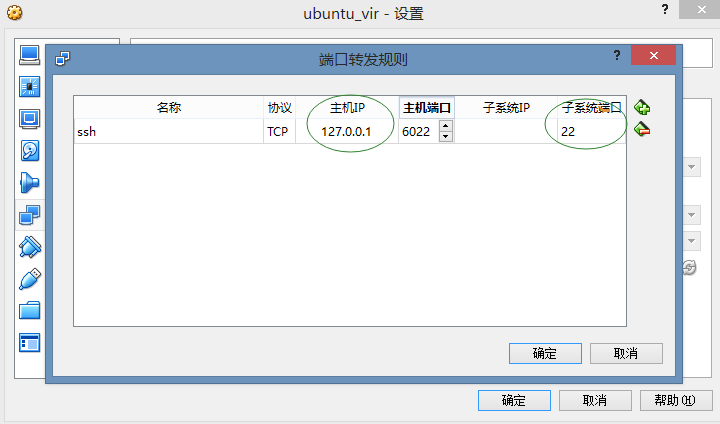

## 虚拟机中三种不同的网络连接方式

### bridged(桥接模式)
在这种模式下，VMWare虚拟出来的操作系统就像是局域网中的一台独立的主机，它可以访问网内
任何一台机器。在桥接模式下，你需要手工为虚拟 系统配置IP地址、子网掩码，而且还要和宿主
机器处于同一网段，这样虚拟系统才能和宿主机器进行通信。同时，由于这个虚拟系统是局域网中
的一个独立的主机 系统，那么就可以手工配置它的TCP/IP配置信息，以实现通过局域网的网关或
路由器访问互联网。
### host-only(主机模式)
Host-Only模式将虚拟机与外网隔开，使得虚拟机成为一个独立的系统，只与主机相互通讯。如果要使得虚拟机能联网，我们可以将主机网卡共享给VMware Network Adapter VMnet1网卡，
从而达到虚拟机联网的目的。

### NAT(网络地址转换模式)
此种方式下，虚拟机并不真实的存在于网络中，所以宿主机无法ping通虚拟机，虚拟机彼此间也
不通。但是通过nat虚拟机可以访问互联网，且可以访问宿主机以及宿主机同网络中的其他主机。
轻松实现上网，不占用网段中的IP地址。宿主机不能访问虚拟机，同网段中的主机无法找到虚拟
机。

## virtualbox中的网络连接

|                  | 桥接                   | NAT                                          | host-only                                |
| ---------------- | ---------------------- | -------------------------------------------- | :--------------------------------------- |
| 虚拟机与宿主机   | 彼此互通，处于同一网段 | 虚拟机能访问宿主机；宿主机不能访问虚拟机     | 虚拟机不能访问宿主机；宿主机能访问虚拟机 |
| 虚拟机与虚拟机   | 彼此互通，处于同一网段 | 彼此不通                                     | 彼此互通，处于同一网段                   |
| 虚拟机与其他主机 | 彼此互通，处于同一网段 | 虚拟机能访问其他主机；其他主机不能访问虚拟机 | 彼此不通；需要设置                       |
| 虚拟机与互联网   | 虚拟机可以上网         | 虚拟机可以上网                               | 彼此不通；需要设置                       |

1. 桥接模式

   虚拟机网络设置桥接模式，centos网络配置文件如下：
```
vi /etc/sysconfig/network-scripts/ifcfg-enp0s3
BOOTPROTO=static
ONBOOT=yes
IPADDR=192.168.0.10
GATEWAY=192.168.0.1
DNS1=8.8.8.8
DNS2=114.114.114.114
```
2. NAT模式
1) 虚拟机的网络连接方式选择网络地址转换NAT模式  
2) virtualbox全局设定的网络中添加nat网络

3) centos中配置文件(同桥接模式)n
此时无法ssh登录，需要端口转发
4) 虚拟机的网络设置中选择高级->端口转发

使用ssh连接127.0.0.1:6022即可。