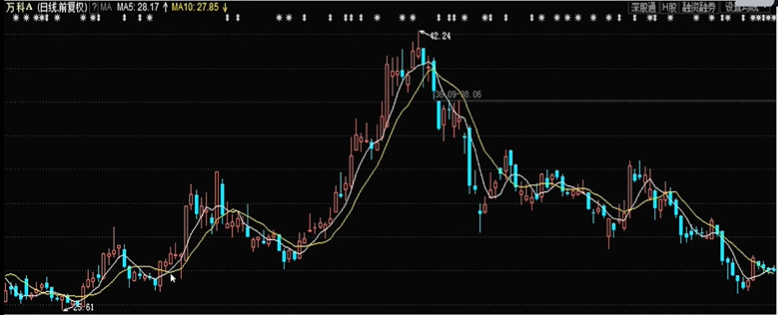

* 金叉死叉策略  
当短期均线上穿长期均线时，形成金叉，此时买入股票。当短期均线下穿长期均线时，形成死叉，此时卖出股票。

白色为5日均线，黄色为10日均线。
* 海龟策略  
1. 当今天的收盘价大于过去20个交易日中的最高价时，以收盘价买入。  
2. 买入后，当收盘价小于过去10个交易日中的最低价时，以收盘价卖出。
* 小市值策略
1. 策略逻辑：市值可以带来超额收益。
2. 策略内容：每月月初买入市值最小的30只股票并且成交额满足一定条件的股票，持有至下个月月初再调仓。
3. 资金管理：等权重买入。
4. 风险控制：无单只股票仓位上限控制、无止盈止损。
* 多头排列回踩买入策略
