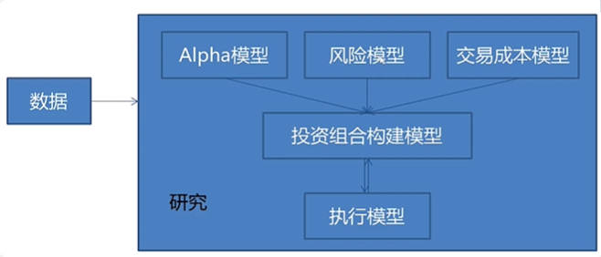
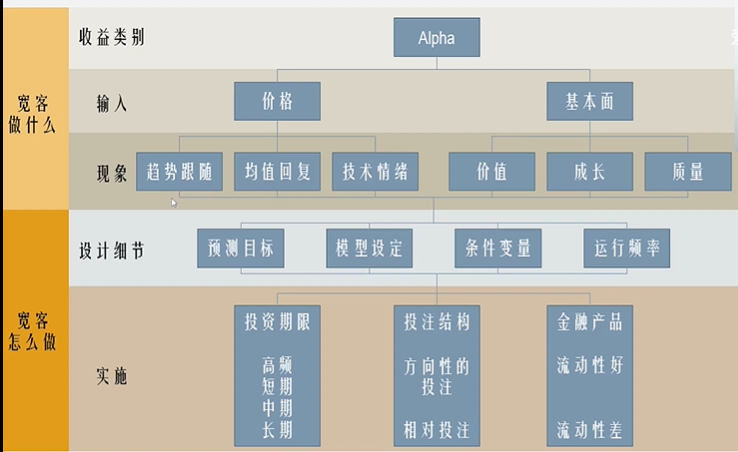
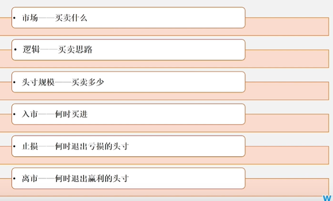
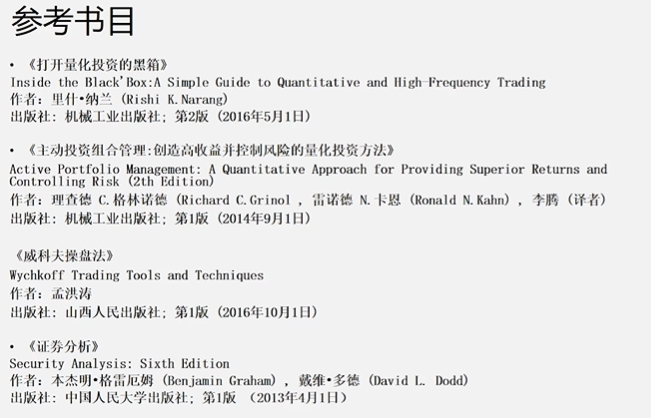
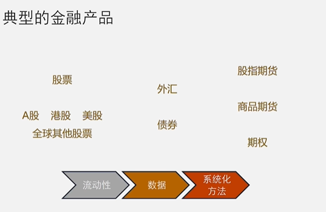
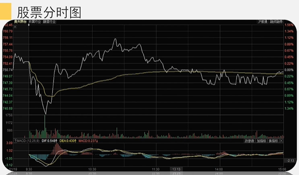
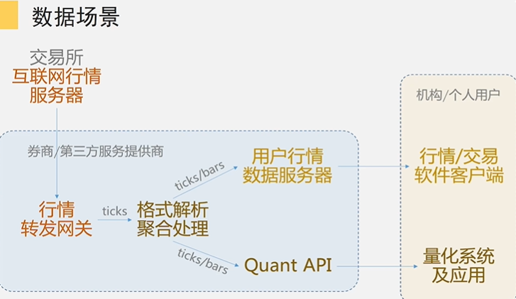
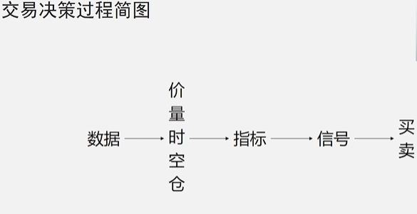

# 量化投资和主观投资的关系
## 金融工程模型分类
### 期货、债券
* CTA趋势
* Mean Reversion
* 统计套利
* 事件驱动
* 日内波动
### 股票、ETF
* Alpha
* 股票对冲
* 期现套利
### 期权策略
* 市场中性 Delta neutral
* I.V. strategy
* 3V matrix
* +Gamma +Theta
## Richard Thailer理论
* 禀赋效应  
人们在决策过程中对利和害的权衡是不平衡的，对“避害”的考虑远大于对“趋利”的考虑。
* 跨期选择  
人类恰恰是不擅长做跨期决策的，大多数时候会做出短视冲动的选择。
* 心理账户&储蓄理论  
人在思考问题时，会在心里构建出分门别类的心里账户，分别进行计算。
## 赚谁的钱？赚什么钱？
1. 市场在某一特定时间内的无效性，或者说是人犯的错误。
2. 主动承担某种特定风险，继而获得承担该风险的溢价。
## 投资组合公式
$$\gamma_{p} = \beta_{p}*\gamma_{B}+\alpha_{p}+\epsilon_{P}$$
投资组合P vs. 业绩基准组合B  
$\gamma_{B}$是业绩基准组合(大盘指数)，$\beta_{P}$是相关系数，$\alpha_{P}$是与业绩组合不相关的部分。
## 量化交易系统的基本架构

# 股票基础知识
## 分时图与K线图的数据处理

### 分时图

白线是价格图，下面的柱状图是成交量，黄线是成交量乘价格图，加权结果。
### K线图
待补充
### 数据场景

### 各类指标的使用方法和实现方法

### 从量化的视角看指标
